The investigation of the 
[three clusters](https://jlmelville.github.io/smallvis/three-clusters.html) 
dataset found that using ASNE with the input bandwidths used in the output
kernel solved all the problems with strange distortions occuring at higher
perplexities. Unfortunately, there was reason to believe that this would
not generalize to other datasets. Let's see if that is the case.

Also, the original description of 
[NeRV](http://www.jmlr.org/papers/v11/venna10a.html) transferred bandwidths
directly from the input kernel to the output kernel. So there is a literature
precedent for this. However, later publications about NeRV don't mention this
step, so it may have turned out to be a bad idea. We shall see.

## Datasets

See the [Datasets](https://jlmelville.github.io/smallvis/datasets.html) page.

## Evaluation

Apart from visualizing the results, the mean neighbor preservation of the
40 closest neighbors is used to provide a rough quantification of the quality
of the result, labelled as `mnp@40` in the plots.

## Settings

Adding bandwidths massively changes the magnitude of the gradients compared
to non-bandwidth methods. This required extensive learning rate twiddling,
both on a per-method *and* per-dataset basis.

```
# eta = 1000 for basne
# eta = 20000 for btasne
mnist_bnerv <- smallvis(s1k, scale = FALSE, perplexity = 40, Y_init = "spca", method = "bnerv", eta = 100, max_iter = 2000, epoch = 100)
```

## Results

Given the lack of anything interesting happening with SSNE, t-SNE and their 
bandwidthed equivalents on the 
[Swiss Roll](https://jlmelville.github.io/smallvis/swisssne.html) data, to save
some effort, we'll only look at ASNE and t-ASNE, and their bandwidthed versions
below.

### iris

|                             |                           |
:----------------------------:|:--------------------------:
|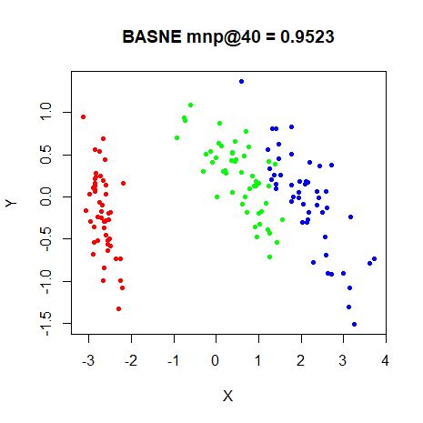
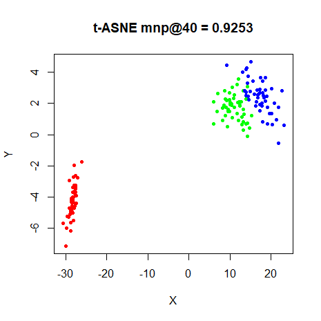|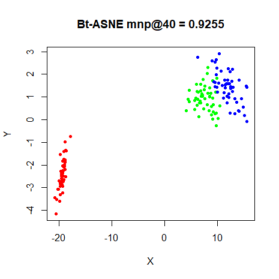
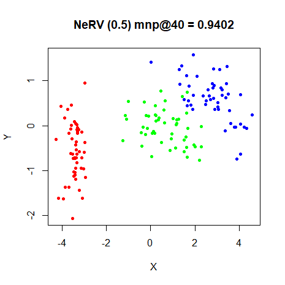|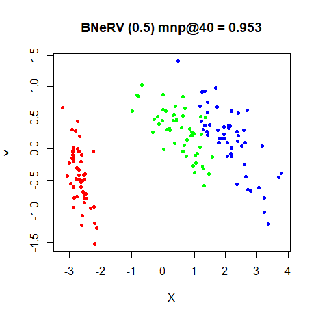

### s1k

|                             |                           |
:----------------------------:|:--------------------------:
|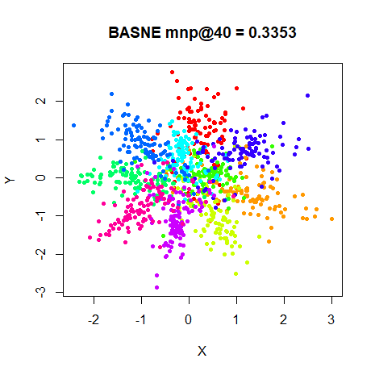
|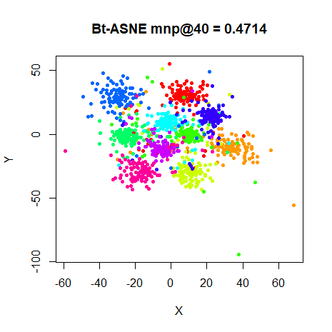
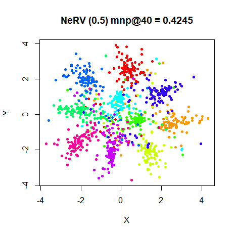|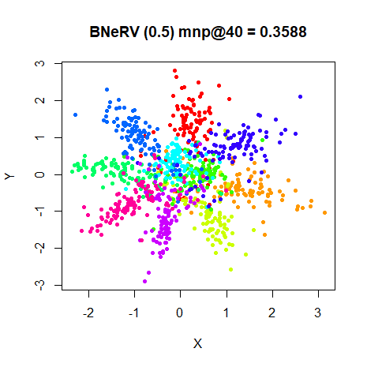

### oli

|                             |                           |
:----------------------------:|:--------------------------:
|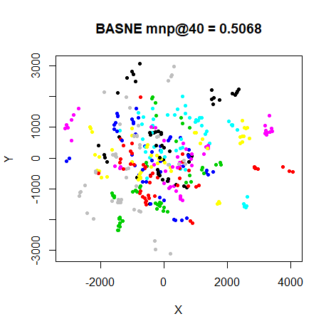
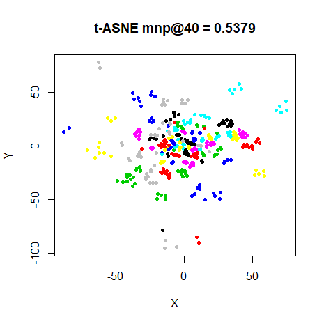|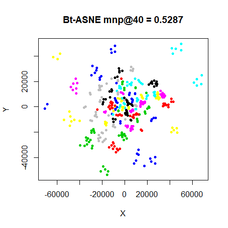
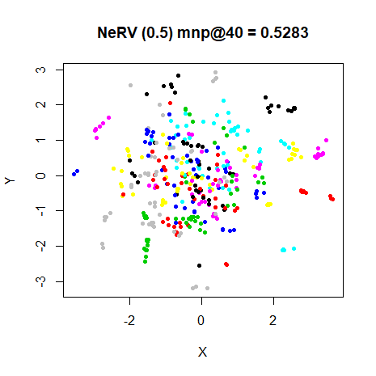|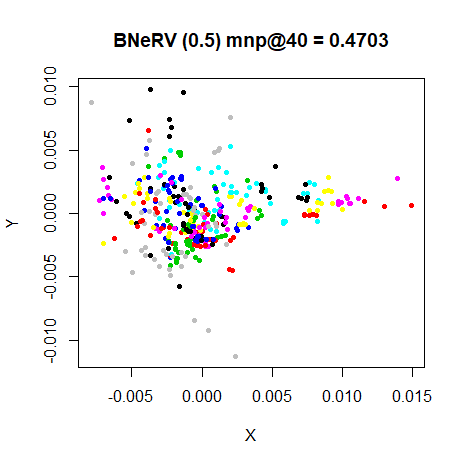

### frey

|                             |                           |
:----------------------------:|:--------------------------:
|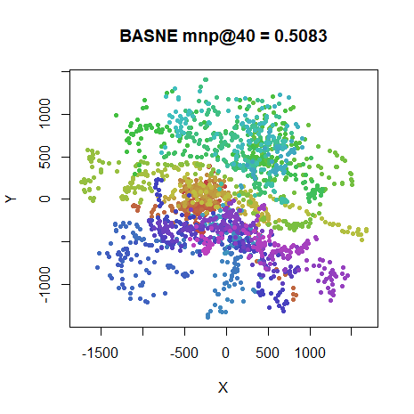
|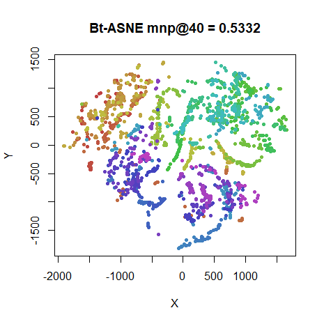
|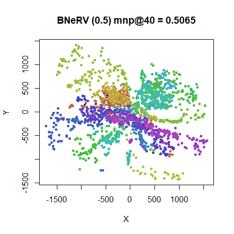

### coil20

|                             |                           |
:----------------------------:|:--------------------------:
|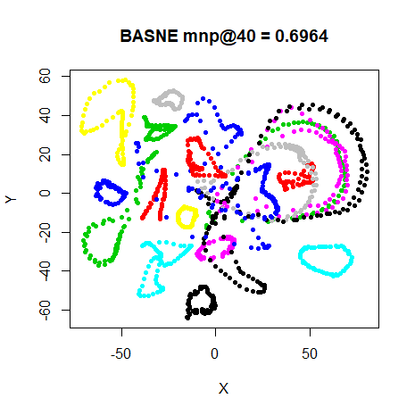
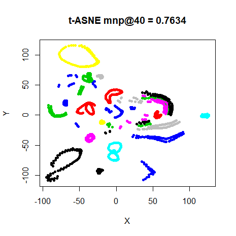|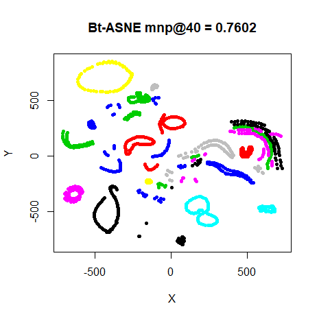
|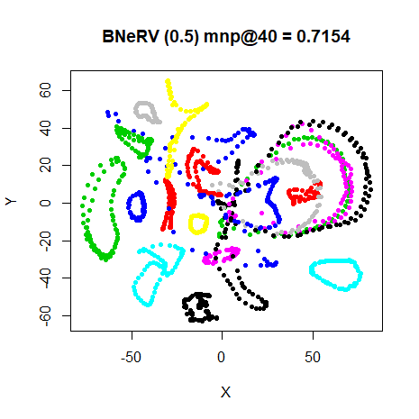

### mnist

|                             |                           |
:----------------------------:|:--------------------------:
|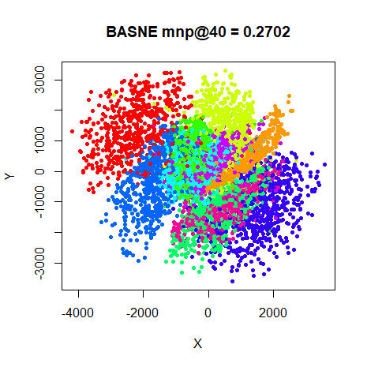
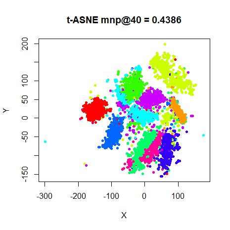|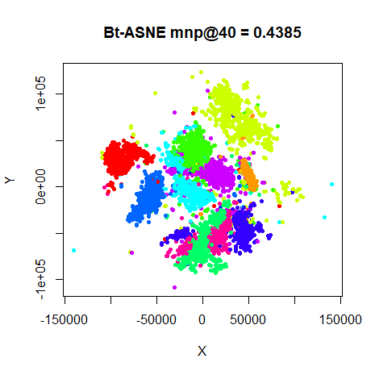
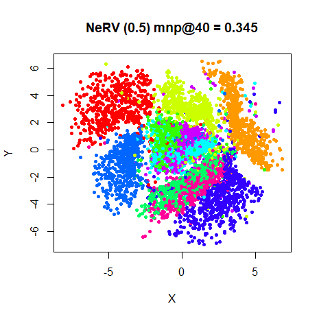|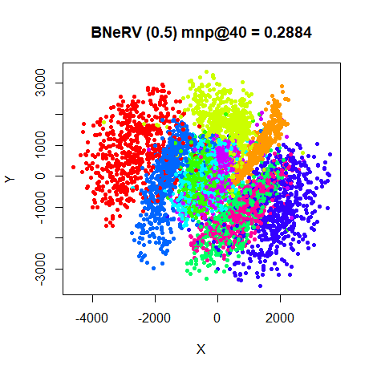

### fashion

|                             |                           |
:----------------------------:|:--------------------------:
|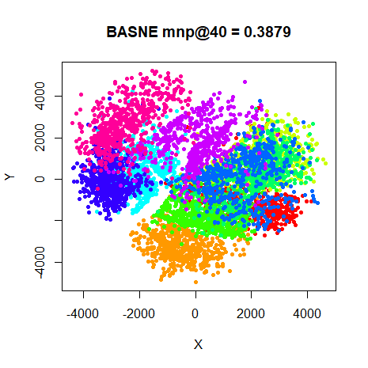
|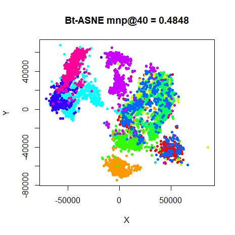
|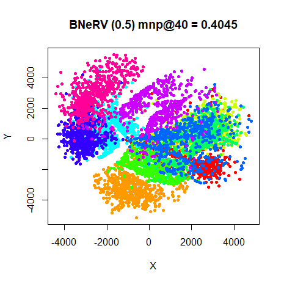

## Conclusions

In terms of neighborhood preservation, there are a few datasets (`iris`, `oli`, 
`frey` and `coil20`) where adding bandwidths to ASNE improves the results by a 
tiny amount. But it's not a major improvement: t-ASNE always outperforms BASNE
except on the consistently anomalous `iris` dataset. So it's not hugely to
discover that t-ASNE and NeRV are improved by adding bandwidths to the output
kernel only for `iris`.

Adding bandwidths directly from the input kernel to the output kernel has
nothing to recommend it, so it's not surprising that the NeRV method stopped
doing it.
