This article is a sequel to the testing of the 
[Heavy-Tailed SSNE](https://jlmelville.github.io/smallvis/hssne.html) method.
In brief, [HSSNE](https://papers.nips.cc/paper/3770-heavy-tailed-symmetric-stochastic-neighbor-embedding) 
generalizes SSNE and t-SNE by means of a heavy-tail parameter, 
$\alpha$. At $\alpha = 0$, it behaves like SSNE, and at $\alpha = 1$, it behaves
like t-SNE. 

In the conclusion of that article, I mention that the 
[parametric t-SNE](http://proceedings.mlr.press/v5/maaten09a) method suggests
that we could optimize $\alpha$ along with the coordinates to get improved
embeddings. Parametric t-SNE calculates the gradient of the cost with respect
to $\alpha$ (the definition of $\alpha$ in that paper is different from that of
HSSNE but they do basically the same thing) and then presumably optimizes
$\alpha$ at each step of optimization.

For more on the gradients involved in optimizing the heavy-tail parameter, see
[here](http://jlmelville.github.io/sneer/dynamic-hssne.html). Doing this in 
`smallvis` complicates the code in a way I don't want to commit to, so I suggest
a simpler method: 

1. At every epoch, calculate the error for the current coordinates at the
current value of $\alpha$. This already happens anyway if `verbose = TRUE`.

1. Repeat the error calculation at a value of $\alpha \pm 0.1$, e.g. if
$\alpha = 0.5$ also look at $\alpha = 0.4$ and $\alpha = 0.6$. Obviously, we
won't let $\alpha \lt 0$.

1. If either of these values of $\alpha$ give a lower error, switch to the value
of $\alpha$ that most reduced the error and continue the optimization.

In this way, $\alpha$ is allowed to drift from its initial value, and hopefully
arrive at a stable value that reflects the data's natural degree of stretching.
This won't be as accurate as doing a proper optimization and using the gradient,
but the results based on manually choosing a fixed value of $\alpha$ didn't
suggest we are going to see a massive change in visualization anyway, so a
resolution of 0.1 seems fine to me. My main interest is to see if
low-dimensional datasets such as `iris` and the Swiss Roll end up at lower
values of $\alpha$ compared to things like `mnist` and `fashion`.

For the starting value of $\alpha$, I use the default value of `0.5` in these
experiments. This seems like a reasonable half-way point between ASNE and t-SNE.
Initial experiments using `alpha = 0` found that the value of $\alpha$ never
changes under these circumstances. Probably, the points end up too crushed
together too early and `alpha` ends up trapped in a local minimum. Using `alpha
= 1` tended to also end up at the same values as starting at `alpha = 0.5` and
given that t-SNE works better than ASNE, that might be a better starting point
for most datasets, but as I say, it probably doesn't matter that much, as long
as the value of $\alpha$ has the chance the change a bit.

Finally, we need to decide on how often to allow $\alpha$ to change. The more
often the change is allowed, the quicker $\alpha$ will (hopefully) reach a 
good value that will allow the optimization to proceed with the spacing out
the clusters in the data correctly, but doing so requires two extra cost
evaluations, so we don't want to overdo it. I chose to set `epoch = 50` entirely
empirically.

## Datasets

See the [Datasets](https://jlmelville.github.io/smallvis/datasets.html) page.

The Swiss Roll will also make an appearance here, because it's easy to see
the difference between an ASNE embedding (which looks decent) and a t-SNE 
embedding (which tears the manifold into small pieces). The it-SNE paper also
uses this and successfully unrolls it, so DHSSNE has a fighting chance also. 
See the 
[Swiss Roll and SNE](https://jlmelville.github.io/smallvis/swisssne.html) page
for more on that dataset. For these experiments I use a 3,000 point version
similar to that used in the 
[inhomogeneous t-SNE paper](http://dx.doi.org/10.1007/978-3-319-46675-0_14):

```
sr3k <- snedata::swiss_roll(n = 3000, max_z = 30)
```

## Evaluation

Apart from visualizing the results, the mean neighbor preservation of the
40 closest neighbors is used to provide a rough quantification of the quality
of the result, labelled as `mnp@40` in the plots.

## Settings

We will compare the DHSSNE with t-SNE results. To account for the fact that we
will probably be spending a portion of the DHSSNE optimization at a non-optimal
value of $\alpha$, I used double the number of iterations (compared to default
settings) to `max_iter = 2000`. As mentioned above, I set `epoch = 50`, so that
the value of $\alpha$ can change every 50 iterations.

Finally, I used the Laplacian Eigenmap initialization instead of the scaled PCA
results I usually use, just to mix things up a bit, but it does help unfold
the Swiss Roll.

```
iris_dhssne <- smallvis(iris, method = "dhssne", Y_init = "lap", scale = FALSE, epoch = 50, perplexity = 40, eta = 100, max_iter = 2000, ret_extra = c("alpha"))
iris_tsne <- smallvis(iris, method = "tsne", Y_init = "lap", scale = FALSE, epoch = 50, perplexity = 40, eta = 100, max_iter = 2000)
```

## Results

For each dataset, the left-hand image below is the t-SNE result. The right-hand
image is the DHSSNE image. The number in parentheses in the title is the final
value of $\alpha$ used for that dataset.

### swiss

|                             |                           |
:----------------------------:|:--------------------------:
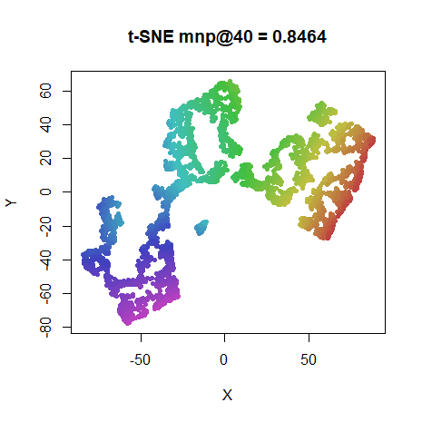|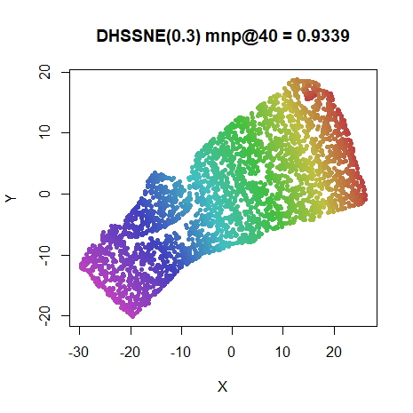

### iris

|                             |                           |
:----------------------------:|:--------------------------:
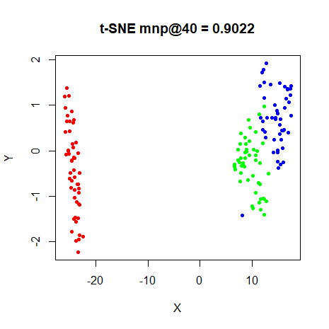|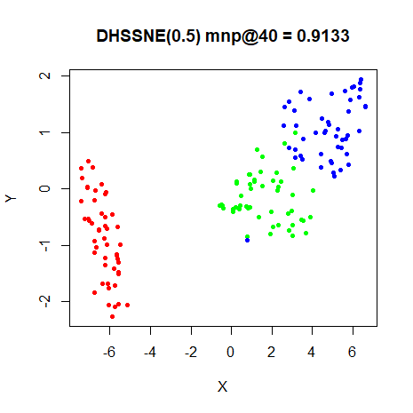


### s1k

|                             |                           |
:----------------------------:|:--------------------------:
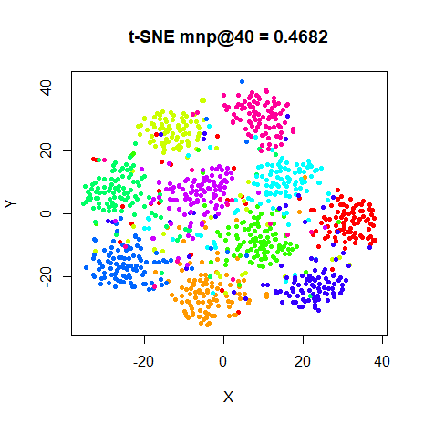|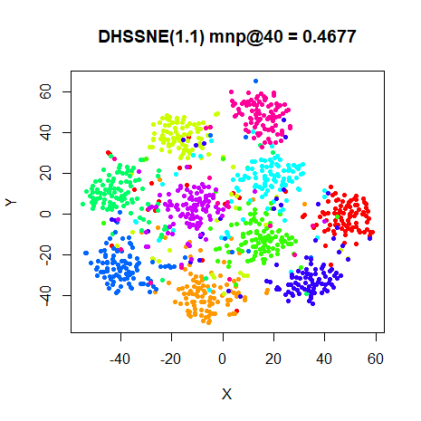

### oli

|                             |                           |
:----------------------------:|:--------------------------:
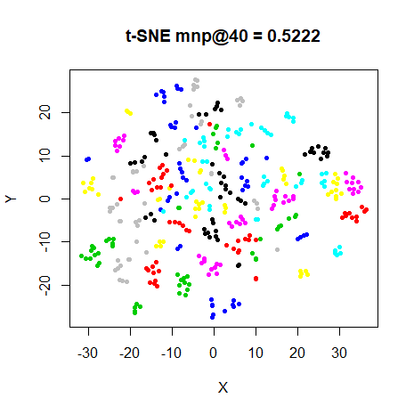|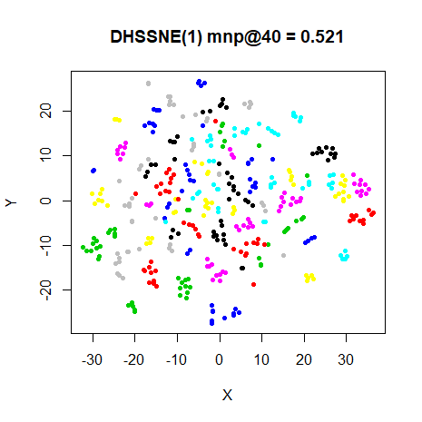


### frey

|                             |                           |
:----------------------------:|:--------------------------:
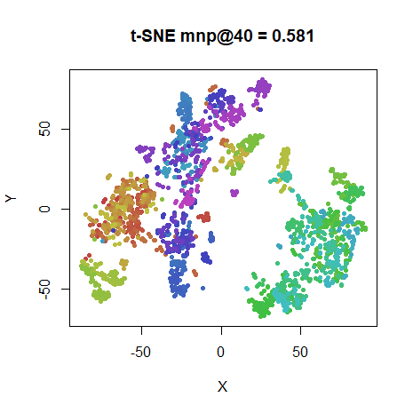|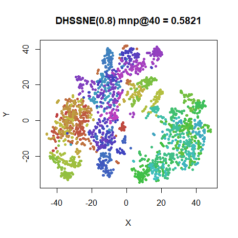

### coil20

|                             |                           |
:----------------------------:|:--------------------------:
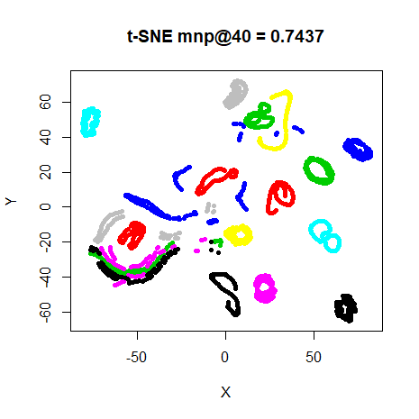|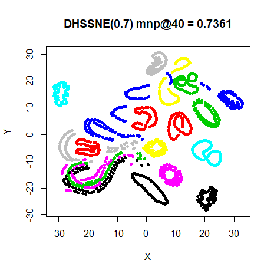

### mnist

|                             |                           |
:----------------------------:|:--------------------------:
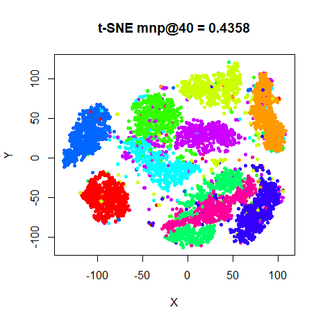|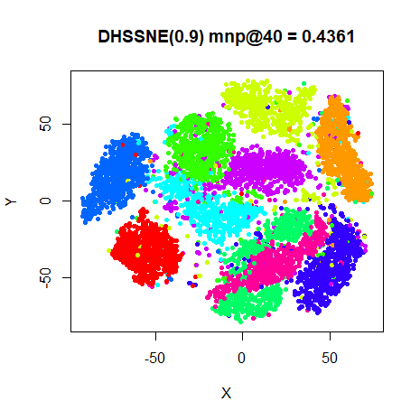

### fashion

|                             |                           |
:----------------------------:|:--------------------------:
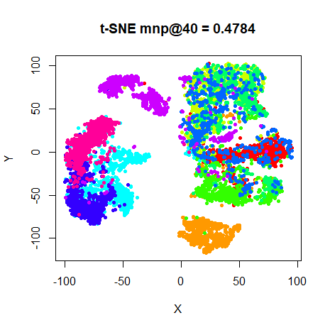|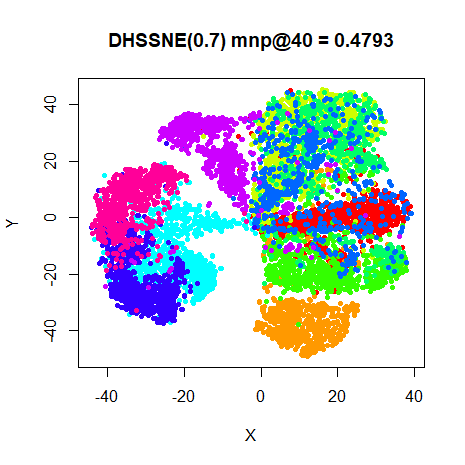

## Conclusions

The Swiss Roll is the big winner with DHSSNE, which looks *much* better than
with t-SNE. Unfortunately, none of the other datasets benefit. Only `s1k` ends
up at an $\alpha \gt 1$, although all the datasets end up with $\alpha \ge 0.5$.
However, the neighborhood preservations are basically unchanged, with `coil20`
and `iris` seeing the biggest change. Visually, `coil20` is probably the most 
affected, and I'd say the t-SNE result is to be preferred there. For the other
datasets the overall structure of the embedding is not affected, but there is
less spacing of any clusters, as expected from using a lower $\alpha$. This
might better reflect the underlying probability distribution that is being 
modelled, but as t-SNE is mostly a visualization tool, there is usually a bias
to seeing more spacing between clusters, so t-SNE is still to be preferred here.

Finally, DHSSNE is slower than HSSNE which in turn is slower than t-SNE. I
suspect the slower behavior of DHSSNE is due to some copy-on-write of the
internal data structures used in `smallvis` when the value of $\alpha$ is
updated, so that can be improved, but the simpler gradient of t-SNE compared to
HSSNE will be fundamentally faster even without those issues.
