[HSSNE](https://papers.nips.cc/paper/3770-heavy-tailed-symmetric-stochastic-neighbor-embedding)
is an embedding method that generalizes SSNE and t-SNE, by introducing an 
`alpha` parameter into the output weight function. When it's set to `1`, it
gives the t-SNE results. As it approaches zero, it gives the SSNE results. 
Values between 0 and 1 therefore give a result where the amount of "stretching"
is intermediate between SSNE and t-SNE. Values of `alpha` greater than one 
correspond a stretching of the output distances that is greater than that
provided by t-SNE.

On the face of it, there's no reason to believe that all datasets are best 
served by a value of `alpha = 1`, which is what using t-SNE does implicitly. 
Some datasets need less stretching (this certainly seems to be the case
with `iris`), and maybe some need more.

The heavy-tailed output kernel is defined as:

$$
w_{ij} = \frac{1}{\left(\alpha d_{ij}^2 + 1\right)^{\frac{1}{\alpha}}}
$$

with $d_{ij}^2$ being the squared output distance. It's easy to see that the
t-distributed kernel is recovered when $\alpha = 1$. You may have to take my
word for it that this becomes the Gaussian kernel as $\alpha \rightarrow 0$ 
(or plot it).

## Gradient

The HSSNE gradient is:

$$\frac{\partial C}{\partial \mathbf{y_i}} = 
  4
  \sum_j
  \left(
    p_{ij} - q_{ij}
  \right)
  w_{ij}^\alpha
  \left(
   \mathbf{y_i - y_j}
  \right)
$$

## Datasets

See the [Datasets](https://jlmelville.github.io/smallvis/datasets.html) page.

## Evaluation

Apart from visualizing the results, the mean neighbor preservation of the
40 closest neighbors is used to provide a rough quantification of the quality
of the result, labelled as `mnp@40` in the plots.

## Settings

Here's an example of generating the results using the `iris` dataset and 
choosing a non-default value for `alpha`. The default value for `alpha` is 
`0.5`, which is arbitrary, but sits between SSNE and t-SNE settings.

```
iris_hssne1_5 <- smallvis(iris, scale = FALSE, perplexity = 40, Y_init = "spca", method = list("hssne", alpha = 1.5), ret_extra = c("dx", "dy"), eta = 10)
```

## Results

The effective value of `alpha` increases from left to right and top to bottom
in the images below. Top left is the SSNE results, which corresponds to 
`alpha = 0`. Top right is `alpha = 0.5`, a setting half way between SSNE and 
t-SNE. Bottom left is t-SNE results, which corresponds to `alpha = 1`. Bottom 
right is `alpha = 1.5`, so allowing the distances to stretch even more than
t-SNE does.

### iris

|                             |                           |
:----------------------------:|:--------------------------:
|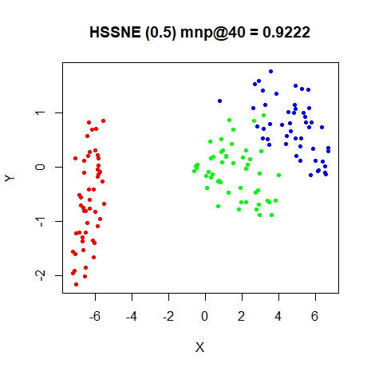
|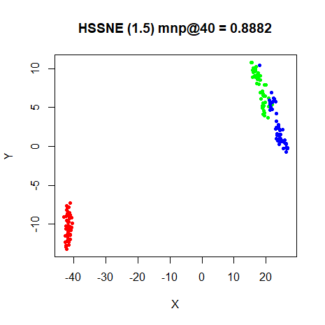


### s1k

|                             |                           |
:----------------------------:|:--------------------------:
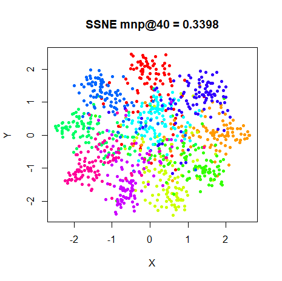|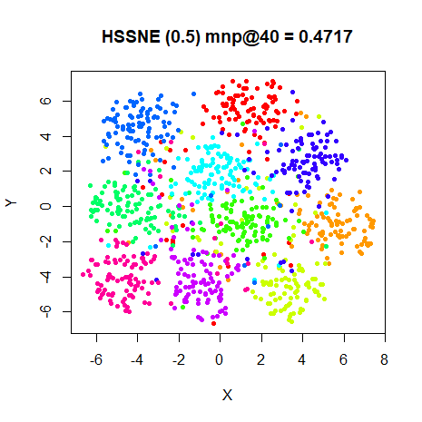
|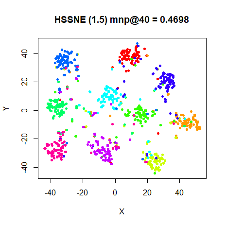

### oli

|                             |                           |
:----------------------------:|:--------------------------:
|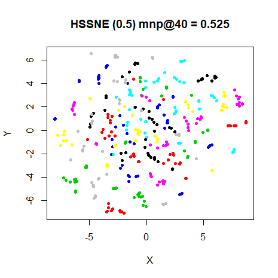
|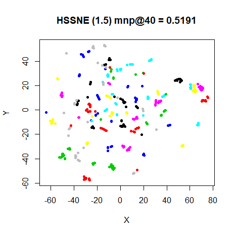

### frey

|                             |                           |
:----------------------------:|:--------------------------:
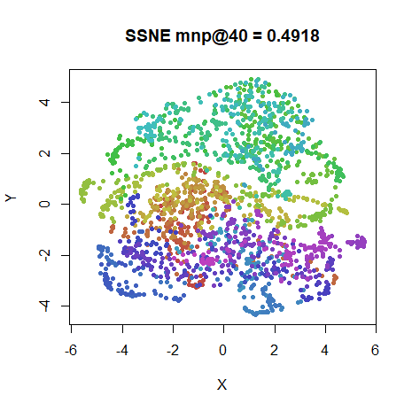|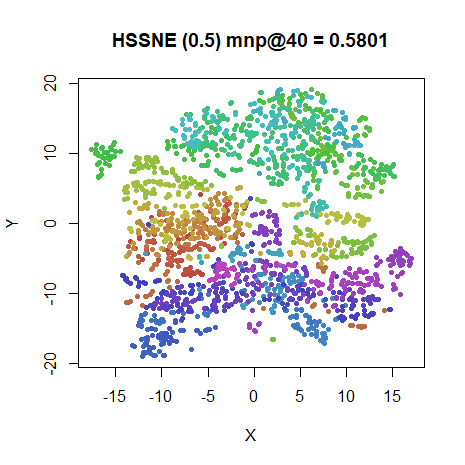
|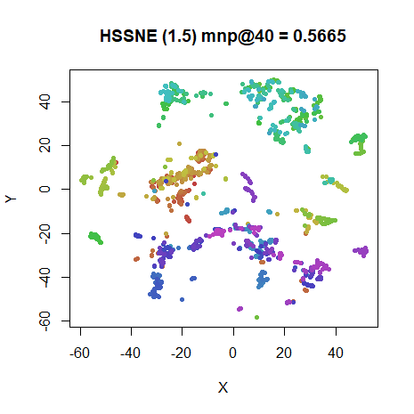

### coil20

|                             |                           |
:----------------------------:|:--------------------------:
|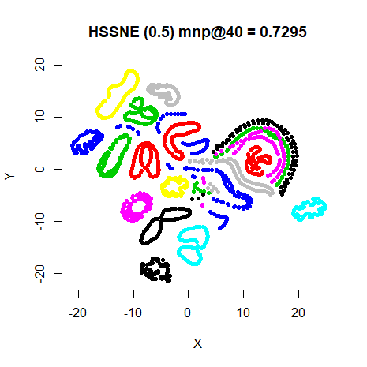
|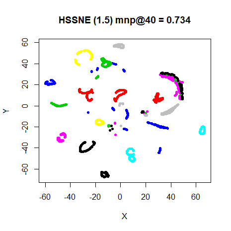

### mnist

|                             |                           |
:----------------------------:|:--------------------------:
|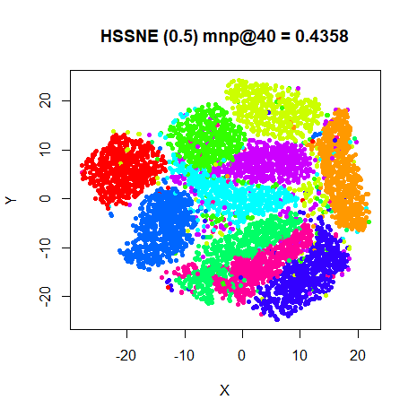
|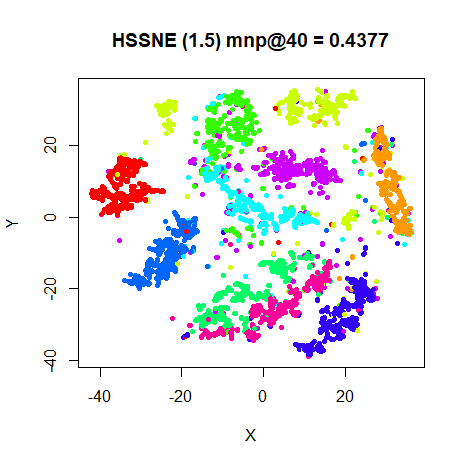

### fashion

|                             |                           |
:----------------------------:|:--------------------------:
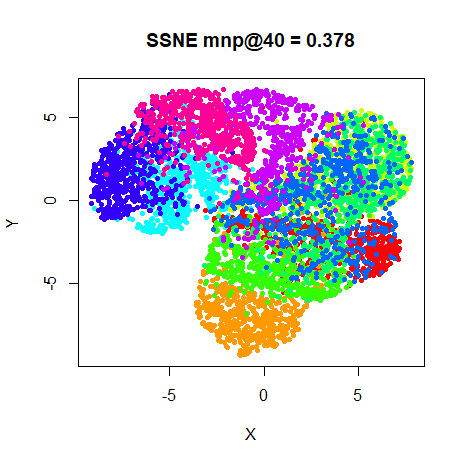|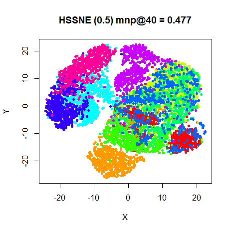
|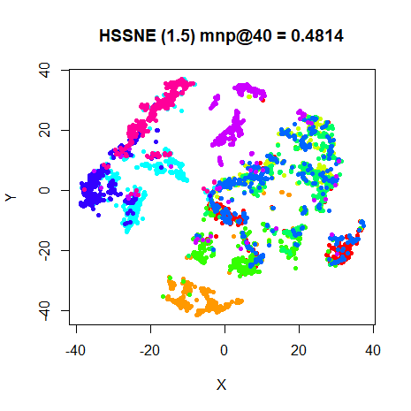

## Conclusions

The effect of increasing $\alpha$ is quite obvious: compressing the 
natural clusters that are present in the results. In some of the cases, an 
$\alpha$ value different from `0` (equivalent to SSNE) or `1` (t-SNE) does give
a superior neighborhood retrieval value. But the difference isn't huge and 
visually I'm not sure you'd be mislead by just using t-SNE in all cases. It may
well be that better results could be found by a more fine-grained search of
an $\alpha$ value for each data set, but it's hard to argue for adding another
parameter that needs fiddling with, especially given that the presence of the 
$\alpha$ power in the gradient slows down the gradient calculation compared to
t-SNE.

Of course, if there was a way to optimize $\alpha$, that might be more 
interesting. There's certainly a way to do this: a similar 
strategy was used by van der Maaten for 
[parametric t-SNE](http://proceedings.mlr.press/v5/maaten09a). 
*Update February 8 2018:* `smallvis` now offers
offers a simple version, which I have dubbed dynamic HSSNE (DHSSNE). You can
read more about its performance 
[here](https://jlmelville.github.io/smallvis/dhssne.html).

Extending this idea would be to use a per-point $\alpha$ value, rather than one
global value, which would allow different cluster densities to expand at
different rates. This *definitely* would require optimization. Such a technique
was described by Kitazono and co-workers and named
[inhomogeneous t-SNE](http://dx.doi.org/10.1007/978-3-319-46675-0_14).
