## Introduction

This is the second part of an investigation into the relationship between
perplexity and intrinsic dimensionality. See the 
[first part](https://jlmelville.github.io/smallvis/idp-theory.html)
for the theory on how perplexity is related to the intrinsic dimensionality of a
dataset via the input weights. The short version is that, borrowing terminology
and ideas from the 
[multi-scale JSE](https://dx.doi.org/10.1016/j.neucom.2014.12.095) paper, 
given the usual t-SNE perplexity calibration, it's then possible to also 
calculate the "soft" correlation dimension for that perplexity using only data
we already generated during the calibration. The term "soft" here indicates
that the neighborhoods are fuzzy due to using the Gaussian weight function,
compared to the "hard" sphere definition of neighborhood usually used in
correlation dimension. For the rest of the discussion, when referring to 
correlation dimension, I'll drop the "soft" modifier, because we're only 
calculating soft correlation dimensions.

In the multi-scale JSE paper, the correlation dimension calculation is repeated
for multiple perplexities and the maximum value is treated as the estimate of
the intrinsic dimensionality for the dataset. We can do exactly the same, but
use the analyical expression, rather than a finite difference estimate. Several
datasets we'll look at here were also used in the multi-scale JSE paper, and
values for the estimate of the intrinsic dimensionality are also given, so we
can do a bit of a sanity check on our calculations by comparing them with the
result in the multi-scale JSE paper.

## Intrinsic Dimensionality Perplexity (IDP)

What can we do with the intrinsic dimensionality estimate? In the multi-scale
JSE paper, the estimate is used in the multi-scale method to modify the output
weight function bandwidths to account for the difference in the output and input
dimensions. But it's not used to choose a perplexity: the whole point of the
multi-scale methods is to obviate the need to choose a perplexity at all. In
multi-scale methods, multiple perplexities are used and the different
probability matrices that result are averaged.

Our efforts will be more modest. We're going to use just one perplexity, but
try and use the intrinsic dimensionality estimate as a guide to choosing the
perplexity: specifically, we'll use the perplexity that is associated with
the intrinsic dimensionality estimate. I'll refer to that as the Intrinsic
Dimensionality Perplexity (IDP).

Without getting into any of the derivations we did previously, these are the
steps we'll take:

First, for each point in the dataset, we calculate the un-normalized input
weight matrix, $\mathbf{V}$, which is associated with a perplexity, $U$. From
there the soft correlation dimension for point $i$ and perplexity $U$, 
$\delta_{i, U}$ can be written as:

$$
\delta_{i, U} = \frac{2}{V_i}
\left\{
\sum_{j}^{N} v_{ij} \left[ \log \left( v_{ij} \right) \right] ^ 2
-\frac{1}{V_i} \left[ \sum_{j}^{N} v_{ij} \log \left( v_{ij} \right) \right]^2
\right\}
$$

where $N$ is the number of observations in the dataset, $v_{ij}$ is the element 
at $\mathbf{V}\left[i, j\right]$, and $V_{i}$ is the sum of the $i$th row of 
$\mathbf{V}$.

The correlation dimension associated with the entire dataset for the given 
perplexity is just the mean average of the individual estimates:

$$\hat{\delta}_{U} = \frac{1}{N} \sum_{i}^{N} \delta_{i,U}$$

The estimate of the intrinsic dimensionality, $D$, is the maximum value that the
correlation dimension attains as the perplexity is varied.

$$D = \max_{U} \hat{\delta}_U$$
The IDP is then:

$$
\DeclareMathOperator*{\argmax}{arg\,max}
IDP = \argmax_{U} \hat{\delta}_{U}
$$

### Multiple IDPs?

Some datasets have different dimensionalities depending on the length scale 
(corresponding to different perplexities), e.g. the Swiss Roll dataset, while
three-dimensional, can be considered two-dimensional over short distances. Under
circumstances where there is more than one maximum of the correlation dimension,
we will favour the smallest IDP value, on the basis that viewing an unfolded
Swiss Roll is more interesting than a folded one.

Swiss Roll-like manifolds seem less common in the real world than datasets made
up of clusters, but here there's also a related issue: is one perplexity really
appropriate across a dataset that's made of multiple clusters, which may well
all be of differing size, variance and homogeneity? 
[How to Use t-SNE Effectively](https://distill.pub/2016/misread-tsne/) notes
this problem and it seems like an obvious solution involving intrinsic 
dimensionality would be to calculate separate IDPs by averaging separately over
each cluster, rather than the entire dataset. To avoid this discussion getting
too unwieldy, we will postpone thinking about that for now, and focus on single
perplexity values from averaging over the entire dataset.

## Method

For an initial attempt at calculating the IDP, we we will carry out the usual
t-SNE perplexity calibration multiple times at different perplexity values.
We'll start at a low value (e.g. 3-5) and look at every integer perplexity up to
around 300, which should be a large enough value to capture any features of
interest.

As discussed above, each observation in the dataset, $i$, is associated with its
own estimate of the correlation dimension at a given perplexity, $U$,
$\delta_{i,U}$. We won't use these individual, per-point estimates directly in
this discussion, but take the mean average of all of them, $\hat{\delta}_U$ to
give a single correlation dimension for a given perplexity.

### Dimensionality Plots

Datasets discussed here will be characterized by their dimensionality plot, 
which is the mean "soft" correlation dimension estimate, $\hat{\delta}$ (which 
I will just refer to as the correlation dimension, and 'Dcorr' as an axis label) 
against perplexity.

### Time Considerations

Obviously, doing loads of perplexity calibrations is slow, and the time taken
increases with the square of the dataset, so carrying out hundreds of
calibrations on a large dataset (`mnist` or `fashion` for example) is not
something you want to do more than once, and couldn't be integrated into
standard t-SNE. A simpler approach that isn't such a computational burden is
suggested in the section "A Practical Suggestion for Perplexity Selecton".

## Results: Synthetic Data

Both "How to Use t-SNE Effectively" and the multi-scale JSE paper used synthetic
data to explore perplexity and intrinsic dimensionality, respectively, so we 
shall also start with some simple synthetic data which will hopefuly provide 
some clear trends and patterns, before we look at real data, which inevitably
destroys all our hopes and dreams with its annoying messiness and real-ness.

### 2D, 5D, 10D Gaussian

An obvious place to start is with some simple Gaussians. We'll look at the
effect of increasing dimensionality, and also of the effect of increasing the
amount of data available to us, although even with these datasets, I don't look
at more than 3,000 points, due to the amount of time it takes to generate plots
for larger datasets.

```
g2d_1k <- snedata::gaussian_data(n = 1000, dim = 2)
g5d_1k <- snedata::gaussian_data(n = 1000, dim = 5)
g10d_1k <- snedata::gaussian_data(n = 1000, dim = 10)

g2d_3k <- snedata::gaussian_data(n = 3000, dim = 2)
g5d_3k <- snedata::gaussian_data(n = 3000, dim = 5)
g10d_3k <- snedata::gaussian_data(n = 3000, dim = 10)
```

The black curve is 2D, the red curve 5D and the blue curve 10D. The left plot
shows the results for 1000 points. The right hand plot is for 3000 points.

| |
:-------|:-------------------:|
||


All the curves have the same basic shape (the black curve has the same shape
although it's hard to see): a steep climb at low perplexity to a maximum, 
followed by a more shallow decrease.

For the 2D Gaussian, the intrinsic dimensionality is `2.12`. For the 5D
Gaussian, the intrinsic dimensionality is `4.30`. For the 10D Gaussian, the
intrinsic dimensionality is `5.69`, so the estimate of the intrinsic
dimensionality becomes an underestimate with increasing dimensionality quite
quickly.

With 3000 points, the estimates of the intrinsic dimensionality are `2.10`, 
`4.58` and `6.53`, respectively. These are all closer to the true 
dimensionality, but not that much closer.

So even for the simple case of a single Gaussian, the absolute value of the
intrinsic dimensionality needs a large number of points to be accurate. But 
we'll hope that the perplexity associated with the intrinsic dimensionality is
still useful.

Let's see how useful an IDP might be. Looking at t-SNE plots of Gaussians is not
exactly informative at the best of times, but
[How to Use t-SNE Effectively](http://distill.pub/2016/misread-tsne/) does note
that a too-low perplexity can lead to the illusion of clusters in the data,
even with Gaussians.

In order to compare with their plots, we'll use their example of a 100-dimension
Gaussian with 500 points. For this data, the estimated intrinsic dimensionality
is 6.8 and the IDP is 23. Running t-SNE on it:

```
g100d_500 <- snedata::gaussian_data(n = 500, dim = 100, color = "#003399")
g100d_500_pexp <- perp_explore(g100d_500, scale = FALSE)
g100d_500_tsne <- smallvis(g100d_500, Y_init = "spca", scale = FALSE, perplexity = 23)
```

The final result is:

| |
|-------|
||

This gives the smooth, fairly uniform distribution of points that the authors
identify as being ideal, but which they found by manually tuning the perplexity.
They use a perplexity of 30, which is close enough to our choice, seeing as 
they try perplexities between 5 and 100. A good start for IDP.

### Ball, Sphere and Helix

The multi-scale JSE paper presents data for some other simple synthetic data: 
a ball, a hollow sphere, and a circular helix:

```
ball <- snedata::ball(n = 1500)
sphere <- snedata::sphere(n = 3000)
helix <- snedata::helix(n = 1500, rmajor = 3, rminor = 1, nwinds = 30)
```

The ball and sphere have an obvious structure. Below on the left is a plot of
PCA on the circular helix, which gives a good indication of what it looks like
and on the right are the intrinsic dimensionality plots. The ball plot is in
black, the sphere plot is in red, and the helix plot is in blue:

| |
:-------|:-------------------:|
||

The sphere and ball plot show a similar structure to the Gaussians, with one
maximum on each plot. The helix plot shows a more interesting structure: two
maxima. Presumably the lower IDP (perplexity = 13) represents the radius of the
helix, and the higher IDP (perplexity = 104) is the overall circular structure
created by joining the ends of the helices.

Perhaps this can be illuminated by running t-SNE at the different perplexities:

```
smallvis(helix, Y_init = "pca", scale = FALSE, perplexity = 13)
smallvis(helix, Y_init = "pca", scale = FALSE, perplexity = 104)
```

Results are below, the low-IDP result on the left and the high-IDP result on the
right:


| |
:-------|:-------------------:|
||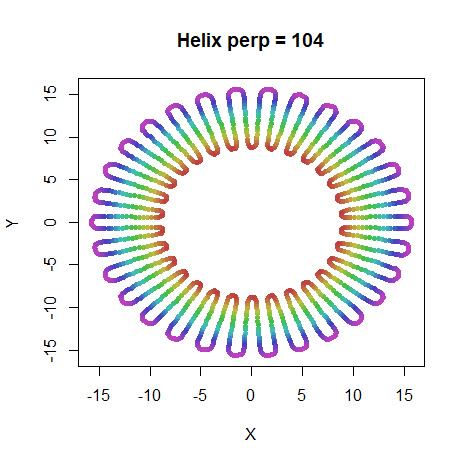

As can be seen, at perplexity 13, the larger circular structure is sacrificed
to emphasise the loops of the helix. At higher perplexity, the overall circular
structure is maintained.

Here's a comparison of the intrinsic dimensionalities calculated in `smallvis`
and those given in the multi-scale JSE paper via the finite difference method
(the perplexity at which the maximum occurs is in parentheses):

| Name    | msJSE      | smallvis              |
| --------| ---------- | --------------------- |
| ball    |  2.81      | 2.75 (17)             |
| sphere  |  2.02      | 2.03 (14)             |
| helix   |  2.47      | 2.66 (13), 2.38 (104) |

The `ball` and `sphere` results are pretty close. Only one `helix` maximum is
reported in the multi-scale JSE paper, and it lies between the two values 
calculated here. I'm not that concerned because the exact values will be 
affected by the radius of the helix and that of the overall circle, which aren't
given in the paper, so I just estimated them from an image in the paper.

### Swiss Roll

Like `helix`, the Swiss Roll also has two different structures at two scales: 
the overall curled topology at a large scale and the unfolded two-dimensional 
sheet that results from small scales. 

```
sr3k <- snedata::swiss_roll(n = 3000, max_z = 30)
```

Here's the dimensionality plot:

| |
|-------|
||

Pleasingly, there are indeed two maxima: a dimensionality of 1.99 at 
perplexity 11, and a dimensionality of 2.55 at perplexity 193. As it's pretty
fruitless to try and 
[unfold the Swiss Roll with t-SNE](https://jlmelville.github.io/smallvis/swisssne.html),
here are the ASNE results for the two perplexities. Both embeddings were
intialized with the Laplacian Eigenmap using the symmetrized ASNE 
matrix with perplexity = 11, which is already quite unfolded. The maximum
number of iterations was set to 5,000, `max_iter = 5000`, to allow the low
perplexity result to converge properly. The perplexity 11 result is the left
hand result below, and the perplexity 193 result is on the right hand side:

| |
:-------|:-------------------:|
||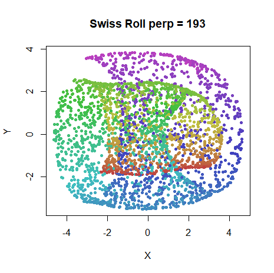

The perplexity 11 result is definitely unfolded, and if it isn't that 
even-looking, that's just par for the course with SNE. The perplexity 193 
result, on the other hand, definitely represents the fully folded structure.

### Ring

In the COIL-20 image dataset (discussed later), several of the image classes
embed as a series of circles, no doubt related to the fact that each image in
the class is the same object slightly rotated. So a 2D ring may be an
interesting synthetic structure to look at in terms of dimensionality. In a
somewhat similar vein,
[How to Use t-SNE Effectively](http://distill.pub/2016/misread-tsne/) discusses
a synthetic dataset involving two linked rings. 

Before we get to that, let's see what sort of structure a single ring has. We'll
look at a regular 2D circle (with 100 points), and a "fuzzy" version, which I
have created from the 2D Gaussian we looked at above, but with points in the
center removed (anything pont a distance from the center of the distribution of
<= 2 was deleted). Below are the 2D structures and their dimensionality plots:

| | |
|-------|------|
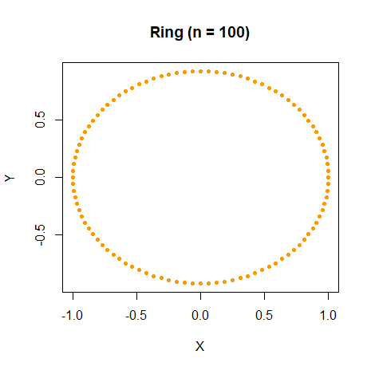|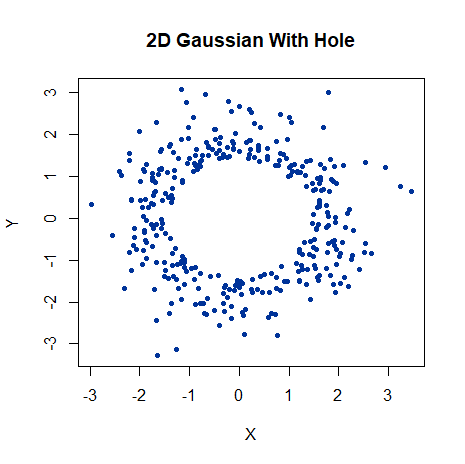|
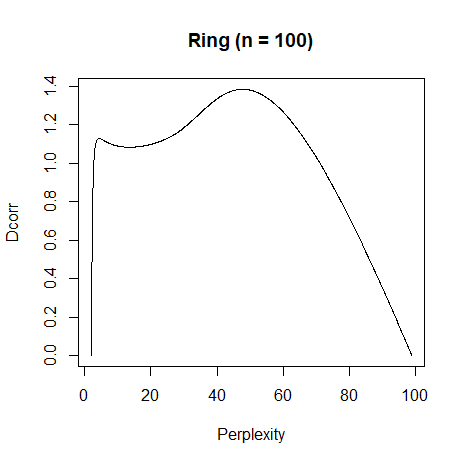|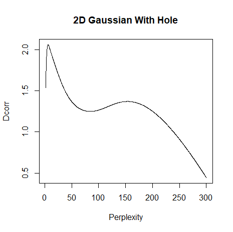|

Both dimensionality plots show the same basic shape with two maxima, although
the relative heights are reversed between the two plots, which reflects the 
trade-off between the size of the hole and the density of points on the 
circumference. For the simple circle characterized in the left hand plot, the
first maxima suggests an intrinsic dimensionality of 1.13 at around perplexity =
4. This is probably very local structure where the curvature of the data is not
terribly pronounced on the scale looked at, so every point's neighborhood is
close to linear, and hence the dimensionality close to 1.

### Linked Rings

As noted above, 
[How to Use t-SNE Effectively](http://distill.pub/2016/misread-tsne/) has an
interesting example involving two linked rings (the same data as used to
generate the ring data used above): one aligned along the XY plane, the other in
the YZ plan. Both are then slightly rotated. At low perplexity they are embedded
as two separate circles, whereas the linkage is displayed at higher
perplexities.

We can use the `snedata` package to reproduce this dataset:

```
link_100 <- snedata::link_data(n = 100)
```

Below to the left is the PCA on the data which shows the layout fairly well. On
the right is the dimensionality plot. Also shown on the right hand plot, in red,
is the dimensionality plot for the single ring that we just saw in the previous
section.

| | |
|-------|-------|
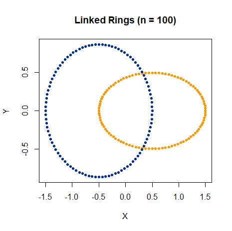|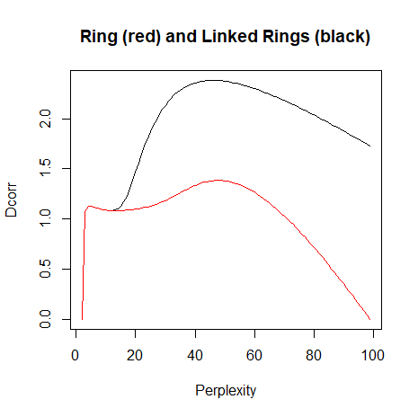|

The dimensionality plot for the two linked rings has a similar structure to the 
single ring with two maxima. At low perplexity we see identical curves, with
the location of the first maxima again occurring at a perplexity of 4.

The presence of the second ring is felt by the broader maximum recording a 
much larger dimensionality (2.38), but it also occurs at close to the same 
perplexity as the single ring, in this case a perplexity of 46.

Below are the t-SNE results with perplexity 4 on the left, and 46 on the right:

| | |
|-------|------|
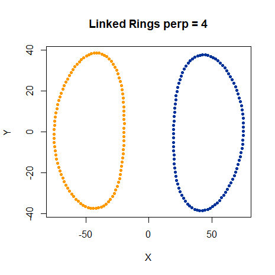|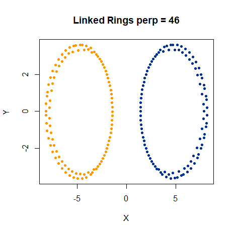|

For both perplexities, the unlinked forms are favored, although the perplexity
46 results show an odd "ripple" in the ring structure (these are also present
in the "How to Use t-SNE Effectively" results). I *did* observe linked
versions for both perplexities, but these were always higher in error than the
unlinked versions, and usually resulted from initializations where the linking
was already present and the optimization got trapped in a local minimum. This
was most pronounced with the perplexity = 4 results. For the perplexity = 46
results, it seemed easier for the embedding to "escape" some initially
overlapping layouts. The initial linkage was seen with both the PCA and
spectral-based initializations I usually favor for t-SNE, and I also found that
early exaggeration helped produce better results here, even though
[I haven't found this to have a huge effect](https://jlmelville.github.io/smallvis/init.html)
on most datasets. 

In short, despite giving this dataset every opportunity to stay in a linked
configuration, the unlinked layout had a lower error for both perplexities.

Tempting as it was to hope that the second maximum represented a perplexity that
corresponded to the linked layout, it seems our hopes have been dashed. Not
that they should have been all that high in the first place, because the second
maximum was already present in the single ring dimensionality plot. To drive
the point home, let's consider an unlinked version of the linked rings, where 
the only change is that the two rings have been translated along the X-axis 
(before they are rotated) so that they don't. Here, yet again, is the 
dimensionality plot, with the unlinked data added as a blue curve:

|  |
|-------|
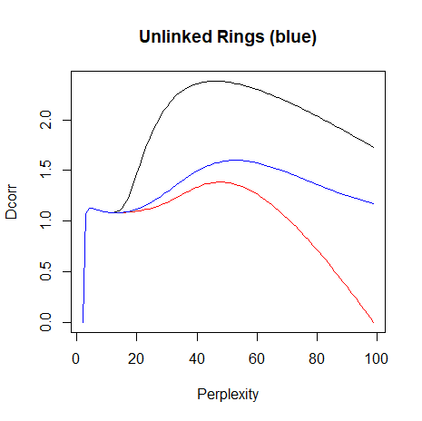|

The plot is now closer to the single ring result, as you might expect due to
the increased distance between the two rings and hence the lower similarity
between points in different rings. But the two maxima are still there. I would
defy anyone to look at the black and blue curve and diagnose a linked topology
from one and not the other.

Like the Swiss Roll, this dataset is perhaps too low-dimensional for t-SNE. Does
ASNE give very different results?

| | |
|-------|------|
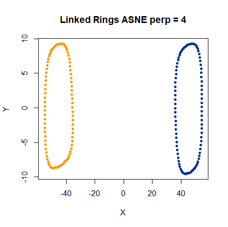|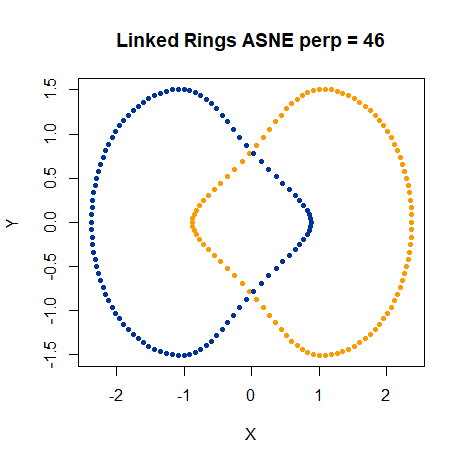|

I should note here that I initialized the perplexity 4 result from the final 
coordinates of the perplexity 4 t-SNE result, and this lead to the lowest error
of all the ways I tried. Random initialization was never able to initialize
the results in a way that ASNE could disentangle them.

But the headline news is that for perplexity 46, the linked form of the rings 
*is* now favored. I initialized the ASNE run from linked, unlinked and
random initializations, but the results always converge to the linked version,
the opposite of what I saw for t-SNE. It should be noted that the linked version
appears for perplexities larger than 30, so there's nothing magical about what
we see at perpelxity 46. It's also worth noting that the strange "ripple" we
saw with the t-SNE results at perplexity 46 is no longer present with the ASNE
results.

If we decide that it's just a coincidence that the ASNE result with perplexity
46 generated the linked configuration (and it would be hard for me to argue
against that interpretation), at least the IDP associated with the first maximum
reproduces the unlinked topology well using either t-SNE or ASNE and without
the distortion of the ring structure that occurs at the higher perplexity.

#### Reproducibility of the perplexity = 46 results

Finally, I should point out that the perplexity = 46 t-SNE results we've been
looking at here are decidedly *not the same* as those in "How to use t-SNE
Effectively". You can confirm this for yourself by re-running the results on
that webpage with the interactive JavaScript widget, multiple times if you like.
The results invariably converge to a linked configuration with the code on that
page.

I'd love it if there was an error with the `snedata` implementation of
the linked rings used here, because the results in "How to use t-SNE
Effectively" show the linked topology appearing between a perplexity of 30 and
50, right in the region identified by the second maximum in the dimensionality 
plot. But we've already seen that this feature is present with a single ring,
and anyway, even though I did find a bug in the `snedata` code, that has been
fixed for the data you see here.

It's also not a problem with the initialization, early exaggeration or learning
rate settings. I tried many combinations of these, but the unlinked
configuration always had the lower error. For a second opinion, I turned
to the [Rtsne](https://cran.r-project.org/package=Rtsne) package, itself a 
wrapper around the 
["official" Barnes-Hut t-SNE implementation](https://github.com/lvdmaaten/bhtsne)
and which has no connection with any of the code in `smallvis`. Rtsne also
judges the unlinked configuration has a lower error, despite various
initialization options, including the linked and unlinked output from `smallvis`
t-SNE runs. Here's an example of how I ran Rtsne:

```
link100_rtsne_u46 <- Rtsne::Rtsne(X = link_100[, 1:3], perplexity = 46, eta = 20, 
exaggeration_factor = 4, theta = 0, pca = FALSE, verbose = TRUE)
```

As the perplexity is increased, `smallvis` *does* start to favor the linked
results and the output resembles that given in "How to Use t-SNE Effectively"
again:

|  |
|-------|
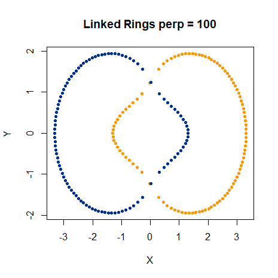|

I currently don't have an explanation of what causes the "How to Use t-SNE
Effectively" t-SNE implementation to converge to different results from
`smallvis` and `Rtsne`. If I ever work it out, I will update this digression.

### Three Clusters

The three clusters in 
[How to Use t-SNE Effectively](http://distill.pub/2016/misread-tsne/) exerts
a strange fascination for me, as it usefully illustrates the limitations of 
t-SNE in reproducing the properties of what seems to be a trivial data set.
I have gone into [great detail](https://jlmelville.github.io/smallvis/three-clusters.html)
on this data previously, but to get started, we just need to know it involves
three 50D Gaussians with 50 points each, arranged in a line, with one of the
clusters a lot further away from the other two:

```
three_clusters_50 <- snedata::three_clusters_data(n = 50)
```

| |
|-------|
|

Here's the dimensionality plot:

| |
|-------|
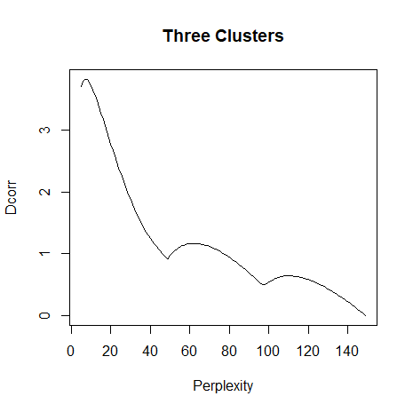|

This shows three maxima: at perplexity 7, 62, and 110. These are clearly picking
out the existence of three clusters in the data. We're really going to stack the
deck in our favor by initializing from the scaled PCA, which at least starts off
with the clusters in a straight line, with the relative distances correct. But
do any of these perplexities give the desired result?

```
three_clusters_tsne7 <- smallvis(three_clusters_50, scale = FALSE, Y_init = "spca", perplexity = 7, eta = 10)
```

| | | |
|-------|------|------|
|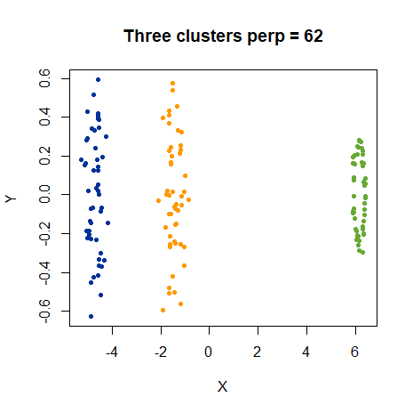|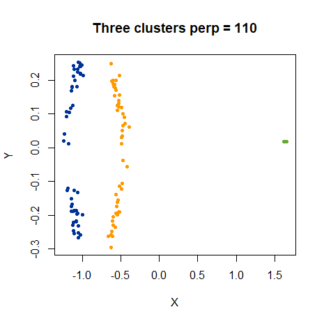|

No, they do not, not that I really expected them to. "How to Use t-SNE
Effectively" leaves open the possibility that multiple perplexity values might
be a solution here, but we'll not pursue that further now. At least using the
lowest IDP does a good job of representing the individual clusters: if you look
at the axes, you'll see they are on different scales, which is why the clusters
look stretched in the Y-axis. But this is preferable to see more details in the
shapes of the clusters at the higher perplexities. 

Reproducing global topologies seems like a tall order for IDP. But based on the
three clusters, the Swiss Roll and the linked rings results together, using the
first maximum as the IDP seems like a good strategy.

### Subset Clusters

Here's one more example from 
[How to Use t-SNE Effectively](http://distill.pub/2016/misread-tsne/): two
Gaussians, each of 50 dimensions and 75 points each, but one (colored blue) has
a standard deviation of 1, and the other (yellow) has a standard deviation of
50. They are both centered at the same point, so the blue cluster is contained
entirely within the yellow one. Here's a PCA plot which shows the situation:

| |
|-------|
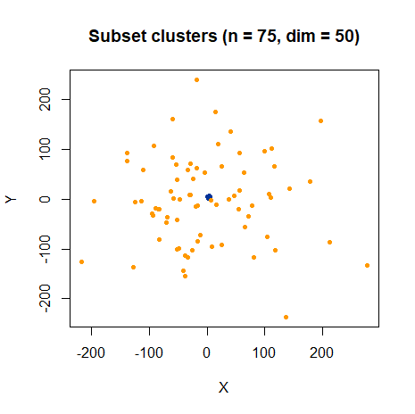|

```
subset_clusters <- snedata::subset_clusters_data(n = 75, dim = 50)
```

and here's the dimensionality plot:

| |
|-------|
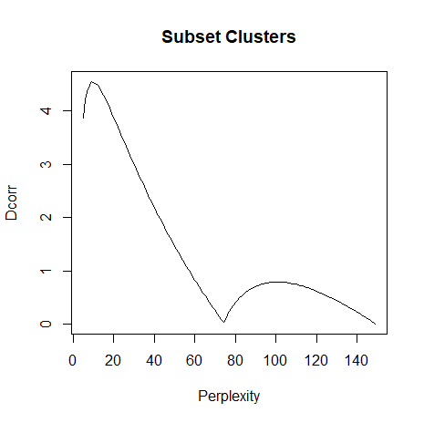|

Note that for this dataset, because of the distribution of distances, numerical
issues prevent the perplexity calibration succeeding for a small number of 
points at low perplexities (perplexity 14 and below). When this happens, 
the k-nearest neighbors get a weight of 1 each, and the intrinsic dimensionality
is set to 0. As a result, for this dataset, the dimensionalities in the 
interesting region may be subject to a small amount of uncertainty.

With that caveat in mind, the IDP for this dataset is 9 and the t-SNE result is:
```
subset_clusters_tsne9 <- smallvis(subset_clusters, scale = FALSE, Y_init = "spca", perplexity = 9, eta = 10)
```

| |
|-------|
|

As noted in [How to Use t-SNE Effectively](http://distill.pub/2016/misread-tsne/),
the smaller blue cluster has its size hugely expanded. But the chosen perplexity
at least avoids the ring shape that forms at large perplexities, so once again
the IDP is a "sensible" value.

Overall, using the IDP (at the lowest perplexity if there are multiple maxima)
does a good job with the simple synthetic data used here. Time to move on to
some more complicated real datasets.

## Results: Real Datasets

We'll now look at how perplexity and correlation dimension are related with
the usual [datasets](https://jlmelville.github.io/smallvis/datasets.html).

The [multi-scale JSE paper](https://dx.doi.org/10.1016/j.neucom.2014.12.095) 
also looked at the `coil20` and `frey` datasets and a subset of `mnist`, in 
their case a 3,000 item subset. We'll compare our intrinsic dimensionality 
estimates with theirs when we hit those datasets, and summarize the comparison
at the end.

### Settings

We'll use standard settings for most of the t-SNE experiments in these pages,
and in particular those from our previous investigation into
[perplexity](https://jlmelville.github.io/smallvis/perplexity.html), with two
changes. First, we'll only use the standard 1,000 iterations. Second, we'll use
the IDP as the perplexity value.

The plots on the perplexity page provide a good set of references for what we
should expect to see. Perplexities between 25-50 seem fine for every dataset.
Low perplexity (e.g. 5) seemed too low, and required larger number of
iterations, without creating any exciting new features in the visualizations.

```
# An example

iris_tsne <- smallvis(iris, scale = "absmax", perplexity = 5, Y_init = "spca", 
eta = 100, exaggeration_factor = 4, stop_lying_iter = 50, max_iter = 1000, epoch = 100) 
```

### iris

Here's the dimensionality plot for `iris`:

| |
|-------|
|

The overall shape of the curves is *very* reminiscent of the synthetic
three-clusters dataset we looked at above. The suggested perplexity is 5 for the
dataset as a whole. We already know that we're not going to love the results,
but here they are:

| |
|-------|
|

Perhaps this indicates that for small datasets, the perplexity tends to be
under-estimated? Alternatively, I could argue that the `iris` dataset is of
sufficiently low dimensionality that t-SNE isn't appropriate, and we should
expect or even *want* to see this sort of distortion of the data so we know to
use a different output weight function. Yeah, not sure I buy that either, but
here's the [HSSNE](https://jlmelville.github.io/smallvis/hssne.html) result
with the stretching function reduced:

| |
|-------|
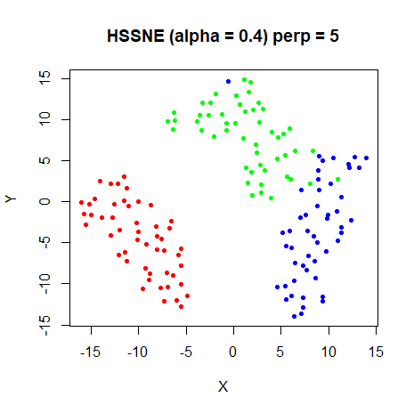|

That is much better. We could just give up now. But we won't. Still so many other
ways for us to be disappointed! Also, in my hands, the 
[pBIC](https://arxiv.org/abs/1708.03229) was awfully fond of suggesting a 
perplexity of 5 as the optimal result for these datasets (see the 
[perplexity](https://jlmelville.github.io/smallvis/perplexity.html) page for 
more details), so I'm in good company.

### s1k

| |
|-------|
|

I wasn't expecting to see much in this plot, as `s1k` is another synthetic
dataset designed by me, such that the ten clusters are very similar. And this is
a reassuringly featureless dimensionality plot. The recommended global
perplexity for this dataset is `26` and here is the resulting t-SNE:

| |
|-------|
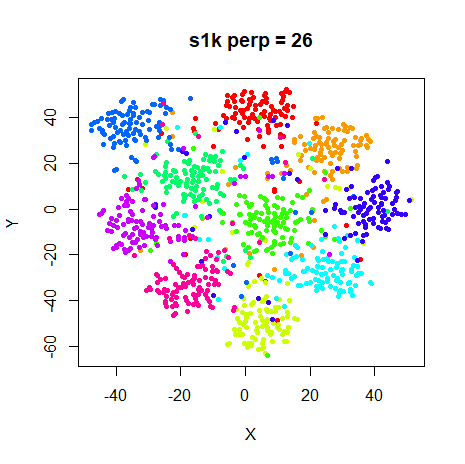|

Big improvement over the results for `iris`, I think. Given that the IDP has
suggested a perplexity that's slap bang in the middle of the 20-30 range, this
is not an Earth-shaking revelation: this is the sort of value you would try
first anyway based on the received wisdom anyway. But at least it didn't suggest
a perplexity of 5. My confidence has returned somewhat.

### oli

The Olivetti faces contain 40 different image classes (one per different face). 
Seems like it could be a candidate for having some hidden structure. Will
the dimensionality plot show anything?

| |
|-------|
||

It does not. The IDP is 17 for this plot, slightly on the low end of things.
Let's see how the t-SNE turns out:

| |
|-------|
||

Another perfectly good visualization.

### frey

The Frey faces dataset doesn't have any classes it can be easily split into on
a priori basis, so if the dimensionalty plot has some extra structure, that would
be quite interesting (and challenging for how we would work out what was going 
on):

| |
|-------|
||

But there's no hint of any extra structure there. The ms-JSE paper gave an intrinsic 
dimensionality of 6.43, while our value is 6.48. Pretty close! The t-SNE result
for the suggested perplexity, 55 (a little outside the usually suggested range)
is:

| |
|-------|
||

Comparing this to the plots at other 
[perplexities](https://jlmelville.github.io/smallvis/perplexity.html#frey) 
suggests this is perfectly reasonable result.

### coil20

`coil20` is another dataset with quite a lot of classes, and these underlying
classes often arrange themselves into loops rather than blobs, so maybe we'll
see something interesting here:

| |
|-------|
||

There's an obvious "shoulder" on the plot compared to all the other datasets,
and that counts as "interesting" to me. This may well be indicating that the
different classes have different intrinsic dimensionalities. Let's see how
well the IDP of 35 does:

| |
|-------|
|

Hmm. That result looks ok. Comparing this to the plots at other 
[perplexities](https://jlmelville.github.io/smallvis/perplexity.html#coil20),
a much lower perplexity of 5 does a good job of separating the different loops
while maintaining their structure. There's not really any indication from 
intrinsic dimensionality that such a low perplexity is warranted though. 

We may have to chalk this one up as a partial failure. Could non-global
perplexities help here? This is one dataset where analyzing the dimensionality
of each class separately looks like a good idea.

For what it's worth, the ms-JSE paper states the overall intrinsic 
dimensionality as 6.50, which our method gives it as 6.63. Not quite as close 
as the `frey` result, but pretty good.

### mnist

| |
|-------|
|

The overall dimensionality plot has a similar structure to the other datasets
we've seen, but is much broader, and the resulting IDP of 115 is well
outside the usual suggested range. Perhaps this is a feature of big datasets?
Let's see what the t-SNE looks like:

| |
|-------|
|

Compared to the plots at other 
[perplexities](https://jlmelville.github.io/smallvis/perplexity.html#mnist), no
great change is apparent. This larger perplexity does seem to encourage more
crowding of the clusters. The estimated intrinsic dimensionality, 9.35, is the
largest of all the datasets we've seen so far. So perhaps similarly to the
`iris` results, this might be an indication that the type of stretching done by
t-SNE is incorrect for this perplexity, although this time it's too little,
rather than too much.

The multi-scale JSE paper also used MNIST, but only sampled 3,000 digits, so it's
not a huge surprise, given what we observed with the Gaussian data, that the
intrinsic dimensionality for that subset was lower, at 8.75. I repeated the
intrinsic dimensionality calculations on a 3,000 digit subset of the 6,000 digit
dataset and the estimate came out as 8.86. Given the vagaries of sampling 3,000
digits from 60,000, I'd say that is pleasingly close to the results given in the
multi-scale JSE paper.

### fashion

The `fashion` dataset is interesting to compare to `mnist`, because it's 
designed to have the same format and same number of classes, features and observations,
but it's a lot harder to separate the classes in 2D. Does it also have a comparatively
large intrinsic dimensionality and IDP?

| |
|-------|
|

Nope. The intrinsic dimensionality of the dataset is a lot smaller (6.10 vs
9.35) and the IDP is 32, well within the usual 5-50 range and much smaller than
the 115 for `mnist`. So it doesn't seem like an increasingly large perplexity is
inevitable for larger datasets, after all.

| |
|-------|
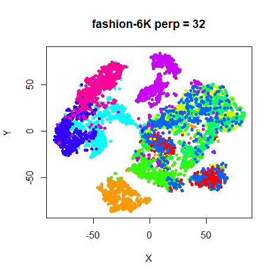|

Not much to say about this t-SNE result: it falls squarely in the range
[previously determined](https://jlmelville.github.io/smallvis/perplexity.html#fashion)
to produce decent results. Let's call this another win for IDP.

### Literature Comparison: Summary

To end the real dataset results, here's a table summarizing the estimates of
intrinsic dimensionality from the multi-scale JSE paper (column `msJSE`) versus
the ones found in this work (columne `smallvis`). The `ball`, `sphere`, and
`helix` entries replicate those from the table given in the "Synthetic Data"
section, but we might as well put it all together for completeness. Numbers in
parentheses under `smallvis` indicate the perplexity at which the intrinsic
dimensionality was found. Also shown are the results for the other "real" 
datasets not considered in the multi-scale JSE paper, to give a feel for the 
range of intrinsic dimensionalities and perplexities.

| Name           | msJSE      | smallvis              |
| -------------- | ---------- | --------------------- |
| `ball`         | 2.81       | 2.75 (17)             |
| `sphere`       | 2.02       | 2.03 (14)             |
| `helix`        | 2.47       | 2.66 (13), 2.38 (104) |
| `frey`         | 6.43       | 6.48 (55)             |
| `coil20`       | 6.50       | 6.63 (35)             |
| `mnist` (3000) | 8.75       | 8.86 (81)             |
| `iris`         |            | 2.44 (5)              |
| `s1k`          |            | 4.95 (26)             |
| `oli`          |            | 7.81 (17)             |
| `mnist` (6000) |            | 9.35 (115)            |
| `fashion`      |            | 6.10 (32)             |

## A Practical Suggestion for Perplexity Selection

Calculate the mean intrinsic dimensionality across the entire dataset at the
following perplexities: 8, 16, 32, 64, 128. Then use the perplexity which
corresponds to the first maximum in intrinsic dimensionality. This captures the
meaningful range of perplexities without requiring a huge number of extra
calculations. For the datasets looked at here, the table below shows the 
perplexities used above, based on calculating the mean intrinsic dimensionality
at every perplexity between 5 and 300 (`perp`) and from just using the five
trial powers-of-two values (`approx perp`):

| dataset   | perp | approx perp |
|-----------|------|-------------|
| `iris`    | 5    | 8           |
| `s1k`     | 26   | 32          |
| `oli`     | 17   | 16          |
| `frey`    | 55   | 64          |
| `coil20`  | 35   | 32          |
| `mnist`   | 115  | 128         |
| `fashion` | 32   | 32          |

These are sufficiently close to the real results in all cases. Admittedly, this 
scheme *would* miss the first maximum in the Swiss Roll example, and therefore
fail to unroll the 2D topology, but we just don't see that sort of structure
in any of these other datasets, so this is a sacrifice worth making in the name
of simplicity.

### IDP in `smallvis`

To use this technique in `smallvis`, set `perplexity = "idp"`, e.g.:

```
iris_tsne_idp <- smallvis(iris, scale = "absmax", perplexity = "idp", Y_init = "spca", 
eta = 100, exaggeration_factor = 4, stop_lying_iter = 50, max_iter = 1000, epoch = 100,
ret_extra = TRUE) 
```

By setting `ret_extra = TRUE`, then the selected perplexity is in
`iris_tsne_idp$perplexity`. Otherwise, if `verbose = TRUE`, then the IDP (and
associated intrinsic dimensionality) is logged to the console. If you don't
want to use the default powers of 2, you can provide a vector pf candidate 
perplexities as the second item of a list, e.g.

```perplexity = list("idp", 3:8)```

Perplexities are tried in the order they are provided and stop as soon as a
maximum is encountered.

## Conclusions

I found quite close agreement between the finite difference results reported in
the multi-scale JSE paper and the analytical formula used here, so there's
probably no major bug or anything systematically wrong with the intrinsic
dimensionality and suggest perplexity values given here. But are any of them
useful?

The previous investigation into 
[perplexity](https://jlmelville.github.io/smallvis/perplexity.html) suggested
that t-SNE results aren't very sensitive to perplexity choice, as long as you
have a decent starting point. But if you wanted a more principled way of choosing
a perplexity, picking the perplexity which maximizes the average correlation
dimension of the dataset seems like quite a solid choice, at the cost of
spending more time doing multiple perplexity calibrations. However, at least in
`smallvis`, the optimization takes up more time than the calibration, and by
restricting the search to powers of 2 between 8 and 128 it might be worth doing.

Across a series of synthetic data and real data sets, this method seemed
to give a reasonable choice of perplexity. The selected perplexity seemed a
little low for `iris`, which might be due to the small size of the dataset, and
results for `coil20` might indicate the perplexity was too high in that case. 
That dataset probably bears further investigation.

It's possible that a different output weight function might improve matters for
some datasets (it seems to for `iris`, which has a noticeably lower intrinsic
dimensionality than the other "real" datasets), and the intrinsic dimensionality
might an estimate for how to choose the `alpha` value in HSSNE, for example. On
the other hand, the `coil20` intrinsic dimensionality is similar to the `frey`,
`oli` and `fashion` results, and there doesn't seem to be any indication that
the t-SNE weight function is particularly inappropriate for them.

Apart from the caveats to do with `iris` and `coil20` results, the main downside
is that this is something that would have to be built into a t-SNE program
directly, because the data needed (the un-normalized input weight matrix) isn't
usually something that is output. It is however, available in `smallvis`, as
described under the "IDP in `smallvis`" section. It is also mentioned in the
man page for the `smallvis` function.

Finally, the `coil20` results indicate that a single intrinsic dimensionality 
may not be able to represent all datasets well, which may also imply different
perplexity values should be applied to different parts of a dataset. The 
current analysis can (and will) be extended to cover that case. Expect a link
to that document here when it's ready.
