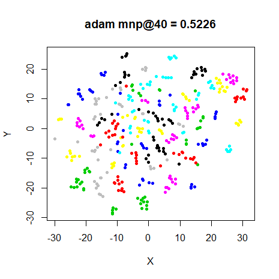
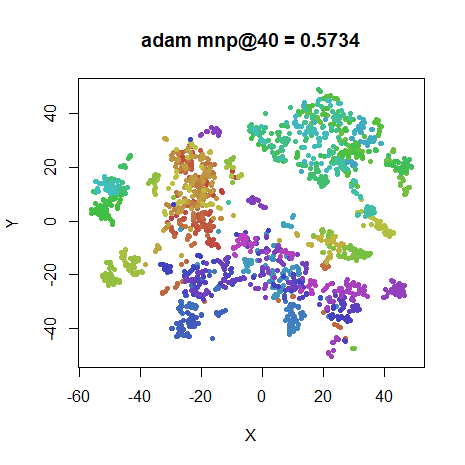
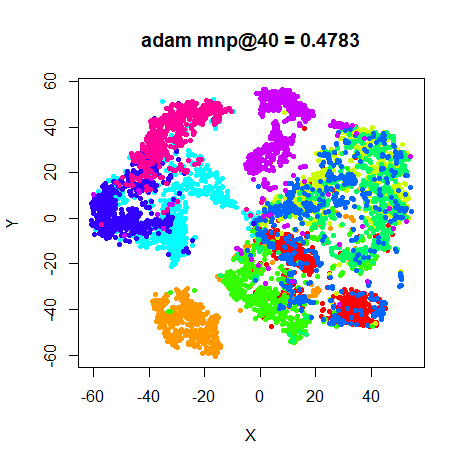

The [delta-bar-delta](https://dx.doi.org/10.1016/0893-6080%2888%2990003-2) method 
used for optimizing t-SNE is an adaptive learning rate technique that
was originally suggested for neural network training. It is mentioned in the same
set of lecture notes that described the 
[RMSprop (PDF)](https://www.cs.toronto.edu/~tijmen/csc321/slides/lecture_slides_lec6.pdf)
stochastic gradient method.

Unlike stochastic gradient methods, DBD is meant for batch learning and only 
uses the sign of the gradient, whereas SGD methods need to take into account
the magnitude of the gradient too. Given what I consider to be the surprisingly
good performance of DBD compared to methods like L-BFGS (see the [optimization]([L-BFGS experiments](https://jlmelville.github.io/smallvis/opt.html) for details), it
would be interesting (to me) to see how SGD methods perform. They certainly
have an advantage of traditional unconstrained optimization methods as being
much easier to implement.

## Datasets

See the [Datasets](https://jlmelville.github.io/smallvis/datasets.html) page.

## Comparison with Adam

[Adam](https://arxiv.org/abs/1412.6980) is a popular technique that seems to
do pretty well for optimizing deep learning tasks. 

The delta-bar-delta results from the 
[L-BFGS experiments](https://jlmelville.github.io/smallvis/opt.html) are 
included for comparison.

Apart from visualizing the results, the mean neighbor preservation of the
40 closest neighbors is used to provide a rough quantification of the quality
of the result, labelled as `mnp@40` in the plots.

## Settings

Here's an example of generating the t-SNE results with Adam.

The Adam results differ from the recommended defaults given by the authors for
deep learning. I settled on these values by experimenting with the `iris`
dataset results.

```
tsne_iris_adam <- smallvis(iris, method = "tsne", perplexity = 40, max_iter = 1000, verbose = TRUE, Y_init = "spca", scale = FALSE, ret_extra = c("dx", "dy"), opt = list("adam", eta = 0.25, beta1 = 0.8))
```

## Evaluation

For each initialization, the mean neighbor preservation of the
40 nearest neighbors, calculated using the 
[quadra](https://github.com/jlmelville/quadra) package: for each point the 40
nearest neighbors are calculated in the input and output space, and the fraction
of neighbors in common is recorded (0 means no neighbors are in common, 1 means
all the neighbors were preserved). The number reported is the mean average over
all results and is labelled as `mnp@40` in the plots. 40 was chosen for these
results to match the `perplexity`.

## Results

The DBD results are on the left, the Adam results are on the right.

### iris

|                             |                           |
:----------------------------:|:--------------------------:
|


### s1k

|                             |                           |
:----------------------------:|:--------------------------:
|


### Olivetti Faces

|                             |                           |
:----------------------------:|:--------------------------:
|

### Frey Faces

|                             |                           |
:----------------------------:|:--------------------------:
|


### COIL-20

|                             |                           |
:----------------------------:|:--------------------------:
|


### MNIST (6,000)

|                             |                           |
:----------------------------:|:--------------------------:
|

### Fashion (6,000)

|                             |                           |
:----------------------------:|:--------------------------:
|

## Conclusions

Given that Adam is designed for stochastic gradient descent optimization of
deep learning, these are surprisingly good results, very similar to what DBD
achieves. As usual, I place greater weight on the results for the MNIST and 
Fashion subsets, which are largest datasets considered. For MNIST, the results 
aren't quite as good visually with Adam (despite showing a slightly higher mean
neighbor preservation), but elsewhere they seem quite competitive.

The degree of convergence didn't seem as far along after 1000 iterations with
Adam compared to DBD, probably because the learning rate might be on the
conservative side. On the other hand, having to tune the momentum (called
`beta1` in Adam) and learning rate parameters for each dataset would remove much
of its appeal anyway.

