As the 
[t-SNE FAQ](https://lvdmaaten.github.io/tsne/#faq) notes, 
"who cares about Swiss rolls when you can embed complex real-world data nicely",
a very reasonable position to take. But 
[Linderman and Steinerberger](https://arxiv.org/abs/1706.02582) think that
Swiss Roll embedding with t-SNE can be improved by modifiying the early 
exaggeration settings, and the 
[it-SNE](http://dx.doi.org/10.1007/978-3-319-46675-0_14) paper also considers
the Swiss Roll. 

Because it's apparently has been asked asked frequently enough to appear on the
t-SNE FAQ, here we shall document the behavior of various flavors of SNE on it,
without expecting to be amazed by any of the results. 

## Datasets

At least in the `snedata` function I use, the general formula for the Swiss Roll
is:

$$
x = \phi \cos \left( \phi \right) \\
y = \phi \sin \left( \phi \right) \\
z = \psi
$$

where $\phi$ is a random number sampled uniformally from $(1.5\pi, 4.5\pi)$ and
$\psi$ is a random number sampled uniformally from $(0, 10)$. For some reason,
the exact formula isn't stated explicitly in either the
[Isomap](https://dx.doi.org/10.1126/science.290.5500.2319) or 
[Locally Linear Embedding](https://dx.doi.org/10.1126/science.290.5500.2323)
papers which seem to have popularized the use of the dataset. This leads to some
minor inconsistencies between publications. Some publication swap the definition
of $y$ and $z$. No-one seems to agree on how large $\psi$ should get. The
maximum value of the Matlab data provided on the 
[MIT Isomap datasets page](http://web.mit.edu/cocosci/isomap/datasets.html)
suggests that it was `50`. 
The [Stochastic Proximity Embedding](http://dx.doi.org/10.1073/pnas.242424399) 
paper uses `10`, the 
[it-SNE paper](http://dx.doi.org/10.1007/978-3-319-46675-0_14) uses `30`, 
probably based on the implementation in the Matlab 
[Dimensionality Reduction Toolbox](https://lvdmaaten.github.io/drtoolbox/)
The [scikit-learn (0.19.1)](http://scikit-learn.org/stable/modules/generated/sklearn.datasets.make_swiss_roll.html)
source uses `21`. It doesn't really matter, as it only affects the length of
the roll. I prefer the default shorter value of `10`, because then PCA will
display the XY cross-section which is a superior visualization for 
understanding the data, as this comparison of the XY and XZ cross-section
of a Swiss Roll with 3000 points and a max $\psi = 30$ demonstrates:

|                             |                           |
:----------------------------:|:--------------------------:
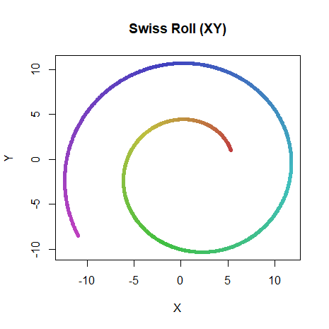|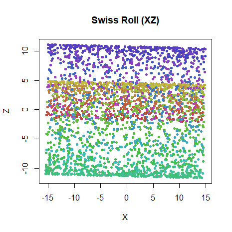

Some versions of the Swiss Roll have the option to add some Gaussian noise to
each coordinate. The DR Toolbox uses a standard deviation of `0.05`. I won't do
that in these experiments here. In short, if you think this matters or you want
to reproduce literature results, you will probably need to see the code used to
generate the roll unless they authors have been incredibly specific (and they
usually aren't).

I'll look at the usual Swiss Roll settings I like to use with 1000 points:

```
sr1k <- snedata::swiss_roll()
```

Then to really overdo it, I'll also look at a larger Swiss Roll data set with
3000 points, with three times the usual length from the defaults I usually use.
This corresponds to the parameters used in the
[it-SNE](http://dx.doi.org/10.1007/978-3-319-46675-0_14) paper, which presents
results which show the Swiss Roll quite well unfolded using ASNE.

```
sr3k_30 <- snedata::swiss_roll(n = 3000, max_z = 30)
```

## Settings

Compared to other datasets, I gave the methods here an extra large number of
iterations to really converge the results, just to try and make sure that if it
was going to get unrolled every method got the chance to get there eventually.
For the Swiss Roll only, I also ran geodesic MMDS to demonstrate that this
manifold is unfoldable.

The investigation of the 
[three clusters](https://jlmelville.github.io/smallvis/three-clusters.html) 
dataset found that using ASNE with the input bandwidths used in the output
kernel might be a good strategy for low-dimensional datasets. So we shall
use those methods here too. These are indicated by adding a 'B' to the beginning
of the methd name, e.g. ASNE with bandwidths is "BASNE".

Other things we'll look at include changing the initialization from scaled PCA
to Laplacian Eigenmaps (spectral-based embeddings have a reputation for doing
a reasonable job on the Swiss Roll), and using the knn input kernel.

Optimization is a mix of the usual Delta-Bar-Delta t-SNE settings, but with the
learning rate adjusted, and L-BFGS, which works perfectly well here with default
settings.

```
# Typical SNE settings
swiss_tasne <- smallvis(swiss, scale = FALSE, perplexity = 10, Y_init = "spca", method = "tasne", eta = 0.1, max_iter = 50000, epoch = 100, tol = 1e-8)

# GMMDS
swiss_gmmds <- smallvis(swiss, scale = FALSE, perplexity = 10, Y_init = "spca", method = "gmmds", eta = 0.001, max_iter = 50000, epoch = 100, tol = 1e-8)

# Laplacian Eigenmap initialization
sr3k_basne_u20 <- smallvis(X = sr3k_30, scale = FALSE, perplexity = 20, method = "basne", Y_init = "lap", max_iter = 50000, epoch = 10, opt = list("L-BFGS"))

# ASNE with kNN input kernel
sr3k_knnasne_u20_pca <- smallvis(X = sr3k_30, scale = FALSE, perplexity = 20, method = list("asne", inp_kernel = "knn"), Y_init = "spca", max_iter = 50000, epoch = 10, opt = list("L-BFGS"));
```

## Results

### 1000 points

|                             |                           |
:----------------------------:|:--------------------------:
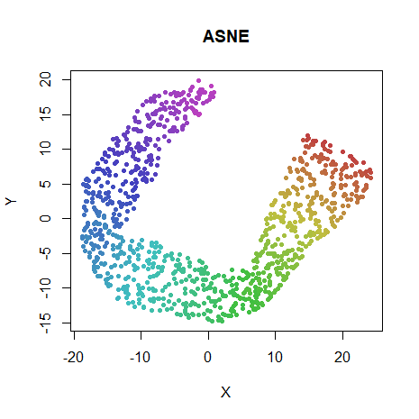|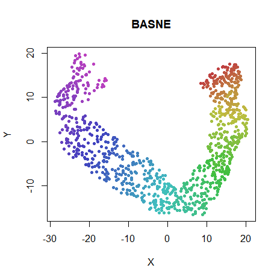
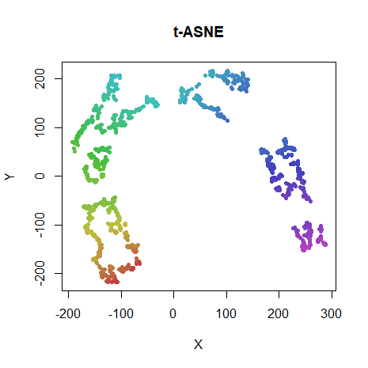|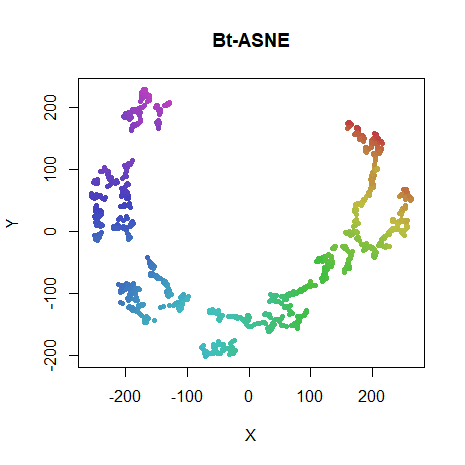
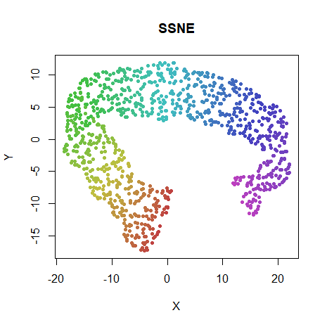|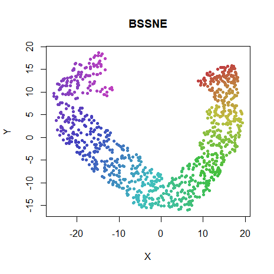
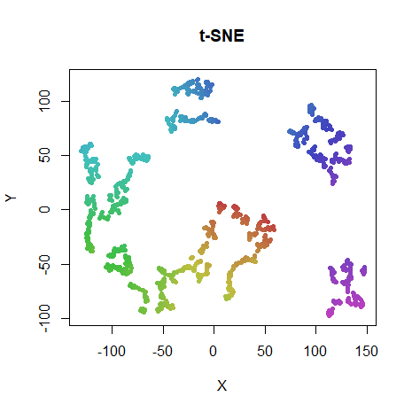|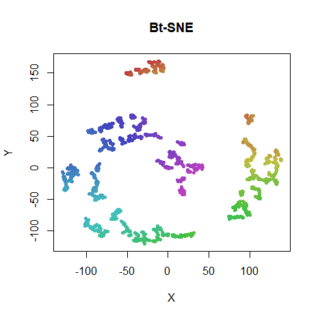
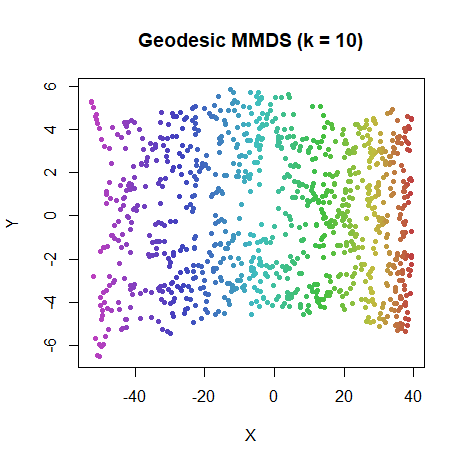|

No SNE method manages to fully unroll the manifold, despite being given ample
number of iterations. By comparison GMMDS gets it done in 100 iterations. BASNE
seems to get closest to fully unrolling. The t-distributed versions do terribly
(as expected), and it can't be said that adding the bandwidths helps. 

SSNE and BSSNE don't do noticeably differently from ASNE and BASNE. 

One possibility as to the difficulty of unfolding the manifold is the lack of a
hard cut-off in the similarity function, which may allow longer range points
to contribute to the gradient, which will encourage the folding. To test this,
we can replace the Gaussian kernel in the input space with a symmetrized 
k-nearest-neighbor graph, where the perplexity is treated as k, and 
$p_{j|i} = 1 / k$ if $i$ and $j$ are neighbors and $0$ otherwise. The output kernel
is still Gaussian (or t-distributed), so it doesn't totally remove long-distance
effects, but it's still worth having a look at.

|                             |                           |
:----------------------------:|:--------------------------:
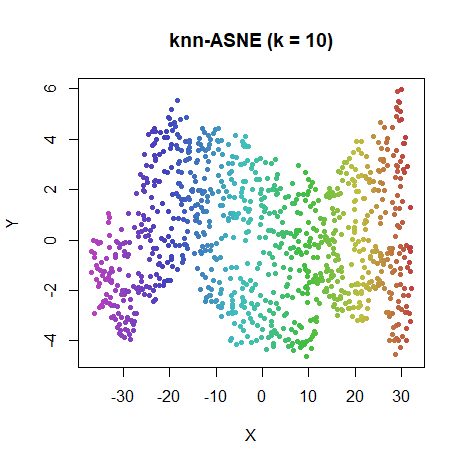|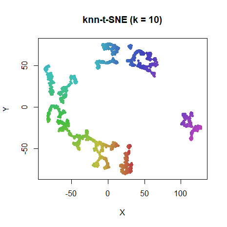

I'll grant that the knn-ASNE looks less than perfect, but it does a lot better
job than any of the others. t-SNE results aren't much different, though.

### 3000 points

As Kitazono and co-workers presented a reasonably well unfolded Swiss Roll
using ASNE, I decided to have another go using their slightly different data set
parameters (the roll is slightly longer). Their initialization used the normal
random initialization, rather than my favored scaled PCA approach. Initial
experiments suggested that in this case, random initializations do work better,
and maybe the PCA initialization was too tough for SNE to unfold. So for the
results below, I use the Laplacian Eigenmap starting point, which is much more
unfolded than the PCA version. The perplexity in this case was set to 20. The
Kitazono results state they used a perplexity of 30, but this seemed to lead to
folding occurring, even with GMMDS. Different scaling options didn't seem to 
have an effect. I even regenerated a Swiss Roll in GNU Octave using the DR 
Toolbox code including Gaussian noise, then reimporting it into R as CSV data, 
but it didn't make a difference. It will have to stay a mystery.

|                             |                           |
:----------------------------:|:--------------------------:
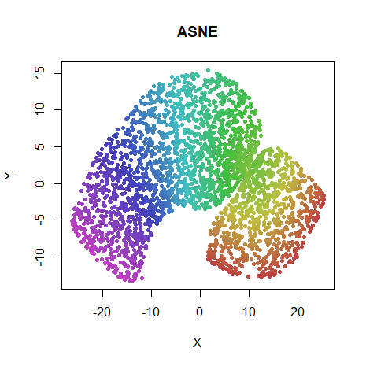|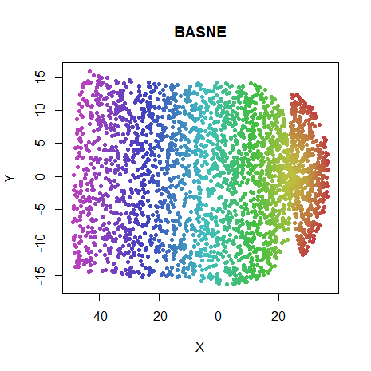
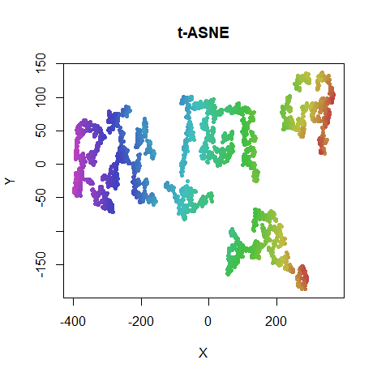|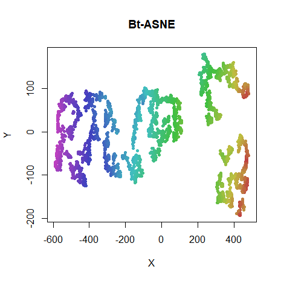
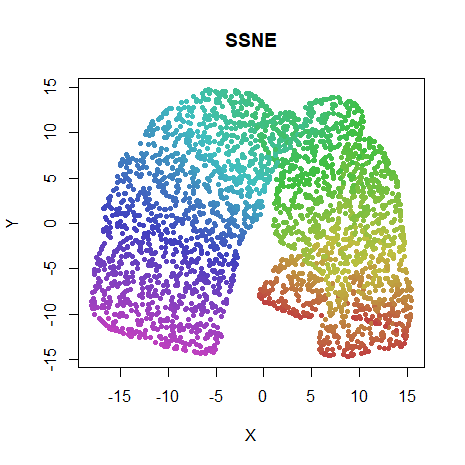|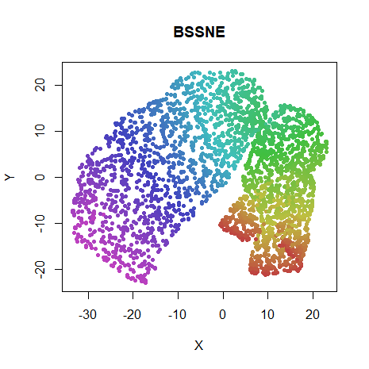
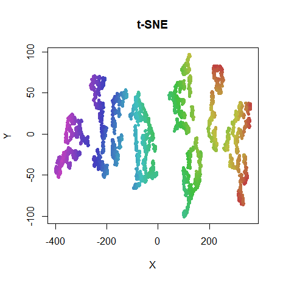|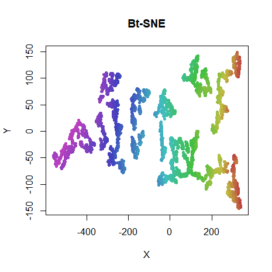
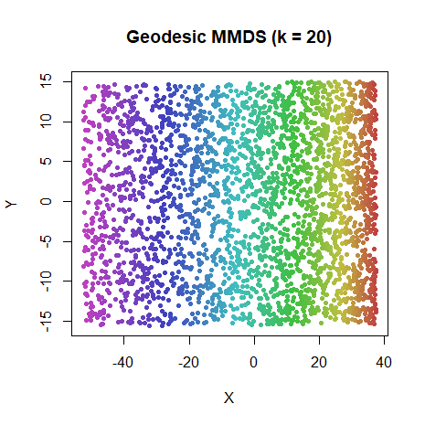|

BASNE does a really good job here, with just a twist in the manifold spoiling
things. Results for the others are less impressive, and the NeRV and BNeRV 
results are barely changed from the initial coordinates. But the t-distributed
results do maintain more an unfolded topology with this initialization than
the scaled PCA version. So in the case where you suspect you have a manifold
that needs unrolling, a Laplacian Eigenmap initialization may be a better choice
than scaled PCA.

Let's also look at the knn input kernel on this dataset, with both SPCA and
Laplacian Eigenmap initialization:

|                             |                           |
:----------------------------:|:--------------------------:
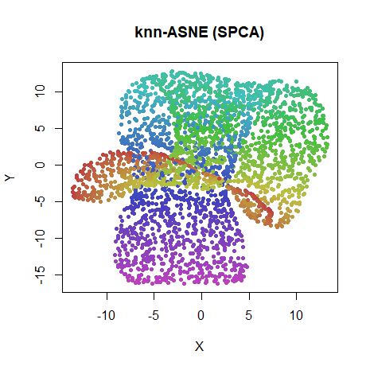|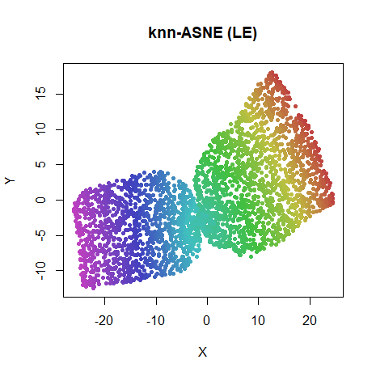

An SPCA starting point is again clearly very hard for SNE methods to unroll. A
hard cutoff in the input probabilities doesn't help that much.

## Linderman-Steinerberger Exaggeration

In [Clustering with t-SNE, Provably](https://arxiv.org/abs/1706.02582), Linderman
and Steinerberger note the connection between spectral methods and the early
exaggeration phase of t-SNE. They specifically look at the Swiss Roll data,
although one which is even more tightly rolled than usual. They show that by
turning up the exaggeration factor significantly, and running the number of
iterations for longer, the global topology of the roll is preserved, in contrast
to the default t-SNE settings.

Can we reproduce these findings in `smallvis`? Further, if early exaggeration
approximates a spectral method (a fact also noted in the 
[Elastic Embedding (PDF) paper](http://faculty.ucmerced.edu/mcarreira-perpinan/papers/icml10.pdf)),
the Laplacian Eigenmap initialization method should resemble those results too.

I used the following settings for this experiment, to more closely resemble
the default t-SNE Matlab settings used in the paper:

```
# Linderman-Steinerberger exaggeration
sr3k_tsne_ls <- smallvis(sr3k_30, scale = "abs", perplexity = 30, Y_init = "rand", method = "tsne", eta = 1, momentum = 0, final_momentum = 0, max_iter = 1000, epoch = 100, tol = 1e-8, exaggeration_factor = 3000, stop_lying_iter = 1000)

# Laplacian Eigenmap
sr3k_le <- smallvis(sr3k_30, scale = "abs", perplexity = 30, Y_init = "lap", max_iter = 0)
```

|                             |                           |
:----------------------------:|:--------------------------:
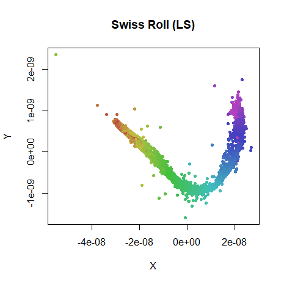|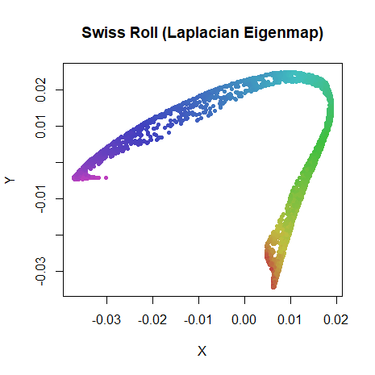

The ultra-exaggerated version looks quite similar to the results given in the
paper, albeit with more outliers. The exaggeration is very large here, so 
probably a more gentle learning rate would help. The Laplacian Eigenmap has
a similar shape. Good enough for my liking, anyway.

## Conclusions

These results don't show that you can use SNE-like methods to embed the Swiss
Roll in 2D very easily. I'd say they indicate that if you really are hell-bent
on doing it, it can be done, but you have to be quite particular about
perplexity, initialization, using the bandwidths from the input data and choosing
the appropriate amount of "stretching" in the output kernel, i.e. t-SNE is not
the right tool for the job here.

Also, the poor performance of the SPCA initialization is apparent here. Given
that the other datasets I look at 
[do pretty well with SPCA initalization](https://jlmelville.github.io/smallvis/init.html),
this is yet more evidence that you don't want to spend time optimizing for
Swiss Roll performance when it comes to real-world performance. But it is extra
evidence that using the Laplacian Eigenmap initialization is a good choice.

