Up: [Documentation Home](https://jlmelville.github.io/smallvis/).

*Update March 15 2018*: This document has been re-written with new results using
settings closer to the defaults of UMAP rather than t-SNE and a smooth k-nearest
neighbors distance treatment that more correctly matches the Python
implementation.

[UMAP](https://github.com/lmcinnes/umap) 
(Uniform Manifold Approximation and Projection) is a dimensionality reduction
method based on reducing the cross-entropy between two fuzzy sets. 
The [UMAP paper](https://arxiv.org/abs/1802.03426) goes into some detail on
the theory, but not into algorithmic specifics. From the point of view of 
the nuts and bolts of the computation, you can work out a fair amount from the
source code. To take a broad view, it's definitely in the t-SNE family of
dimensionality reduction, but with a different theoretical underpinning, and the
implementation itself is similar to LargeVis in how it scales to large datasets.

More details on the cost function and resulting gradient can be read on the
[theory](https://jlmelville.github.io/smallvis/theory.html) page. What makes
UMAP (and LargeVis) of specific interest is that, unlike t-SNE, it doesn't 
require normalization in the output step to convert affinities to probabilities. 
This is in fact the key to its superior scaling to very large datasets, 
compared to Barnes-Hut t-SNE.

The reason that this lack of normalization is important is
because normalization has been suggested as being one of the properties that
leads to the superior performance of t-SNE over other methods (see, for example,
this 
[perspective by Lee and Verleysen](http://dx.doi.org/10.1109/CIDM.2014.7008663)).
It's important to note that normalization is still carried out on the input
affinity matrix in UMAP, although in a slightly different way to the 
perplexity-based calibration used in t-SNE. Another difference is that while 
the input matrix is symmetrized, the final normalization step used in t-SNE
(division by the grand total of the matrix so all the "probabilities" sum to 1)
is not carried out in UMAP.

## Variations on UMAP

### t-UMAP

The UMAP gradient contains some extra terms compared to the t-SNE version that
make it more expensive to calculate. But we can simplify matters considerably by
adopting the t-SNE weighting function: the Cauchy distribution, which arises
naturally in UMAP by setting the `a` and `b` parameters of its weighting
function to `1`.

The gradient for t-UMAP is therefore:

$$
\frac{\partial C_{t-UMAP}}{\partial \mathbf{y_i}} = 
  4\sum_j^N 
\left(
   v_{ij}
-
  w_{ij}
\right)
   \frac{1}{d_{ij}^2}
   \left(\mathbf{y_i - y_j}\right)
$$
which can also be written as:

$$
\frac{\partial C_{t-UMAP}}{\partial \mathbf{y_i}} = 
  4\sum_j^N 
\left(
   v_{ij}
-
  w_{ij}
\right)
   \frac{w_{ij}}{1 - w_{ij}}
   \left(\mathbf{y_i - y_j}\right)
$$

### Normalized t-UMAP

A further modification of t-UMAP, that normalizes both the input and output
affinities in the style of t-SNE. I have no theoretical justification for 
doing this, but I was curious to see the effect of normalization on both
the results and the ease of optimization was.

The gradient for normalized t-UMAP is:

$$
\frac{\partial C_{nt-UMAP}}{\partial \mathbf{y_i}} = 
  4\sum_j^N 
\left(
   \frac{p_{ij} - q_{ij}}{1 - q_{ij}}
+
  \sum_{kl} \frac{p_{kl} - q_{kl}}{1 - q_{kl}}
    q_{ij}
\right)
   w_{ij}
   \left(\mathbf{y_i - y_j}\right)
$$

I'm sure there's a nicer or clearer or more efficient way to express that, but
I wasn't motivated to find it.

## Datasets

See the [Datasets](https://jlmelville.github.io/smallvis/datasets.html) page.

## Settings

The `gr_eps` parameter was set to `0.1`, the value used in LargeVis, which gives
slightly better results than the Python UMAP reference implementation value of
`0.001`. In `smallvis`, both the LargeVis and UMAP methods use `gr_eps = 0.1` as
defaults, but I'm setting it explicitly below in the example code below to avoid
ambiguity.

Smaller values of `gr_eps`, while preferable for making the gradient more
accurate, cause rather erratic behavior in optimization, with lots of tight,
small clusters forming, which take a large number of iterations to coalesce, and
the results are rarely different from using `gr_eps = 0.1`. As a brief test, 
I took the `iris` and `s1k` datasets and ran with `gr_eps = 0.1` to convergence.
Then I starting a second UMAP run with `gr_eps = 0.001`, `gr_eps = 1e-10` or 
`gr_eps = .Machine$double.eps`, initialized with the final coordinates of the 
`gr_eps = 0.1` run. In all cases, I saw barely perceptible changes to the 
coordinates and only a small change to the gradient norm and cost. While this
is hardly conclusive proof, it's reasonable to proceed with `gr_eps = 0.1`.

Like other non-normalized cost functions I've looked at (e.g. elastic 
embedding), UMAP is much harder to optimize than t-SNE. The delta-bar-delta
method requires a much smaller learning rate and consequently much larger number
of iterations. For the larger datasets `mnist`, and `fashion` (and remember
these are only 6,000-item subsets), optimization this way is truly painful,
Optimizing `mnist` with UMAP took several days to get to 50,000 iterations. This
is definitely overkill, but still something to bear in mind, particularly as
the default settings for UMAP, use a small neighborhood size (compared to t-SNE),
which (as seen with looking at 
[perplexity in t-SNE](https://jlmelville.github.io/smallvis/perplexity.html))
requires larger number of iterations.

In practice, L-BFGS with step-wise scaled
perplexity, which is the best general purpose approach embedding 
[optimization method](https://jlmelville.github.io/smallvis/opt.html) I have
come up with, is a more cost-efficient alternative, and I would suggest using
that instead of DBD. However, nt-UMAP *does* work with DBD as well as t-SNE,
so to try to be as consistent as possible with the methods here and as a 
comparison with t-SNE, all the results show here use DBD, but with different
values of `max_iter`.

Other settings are adjusted from the usual t-SNE defaults to match those of
UMAP. The initialization method is `Y_init = "normlap"`, which uses the lowest
eigenvectors of the normalized Laplacian based on the input weights.

When used with UMAP, the `perplexity` setting is interpreted as the value of `k` 
to use in the smooth k-nearest-neighbor calibration. The UMAP default is `15`, 
lower than usual values for t-SNE (where it's usually between `30` and `50`).

Some examples invocations for `iris`:

```
iris_umap <- smallvis(iris, scale = FALSE, perplexity = 15, Y_init = "normlap", method = list("umap", gr_eps = 0.1), eta = 0.01, max_iter = 50000, epoch = 100)
iris_tumap <- smallvis(iris, scale = FALSE, perplexity = 15, Y_init = "normlap", method = list("umap", gr_eps = 0.1), eta = 0.01, max_iter = 50000, epoch = 100)
iris_ntumap <- smallvis(iris, scale = FALSE, perplexity = 15, Y_init = "normlap", method = "ntumap",  max_iter = 5000, epoch = 100)
iris_tsne <- smallvis(iris, scale = FALSE, perplexity = 15, Y_init = "normlap", method = "tsne",  max_iter = 5000, epoch = 100)
```

## Evaluation

For each initialization, the mean neighbor preservation of the
15 nearest neighbors, calculated using the 
[quadra](https://github.com/jlmelville/quadra) package: for each point the 15
nearest neighbors are calculated in the input and output space, and the fraction
of neighbors in common is recorded (0 means no neighbors are in common, 1 means
all the neighbors were preserved). The number reported is the mean average over
all results and is labelled as `mnp@15` in the plots. 15 was chosen for these
results to match the `perplexity`, which is treated as the value of `k` in the
smoothed k-nearest neighbors calculation in UMAP.

## Results

For each dataset, four results are shown. The first row shows UMAP and t-UMAP
on the left and right, repectively. On the second row is normalized t-UMAP
and t-SNE results.

### iris

| |
:-------|:-------------------:|
|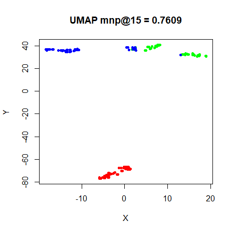|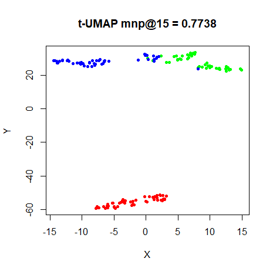
|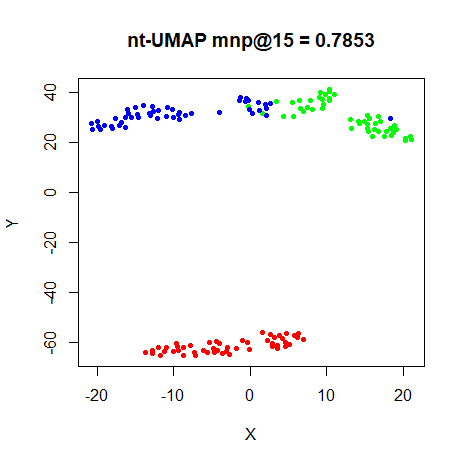|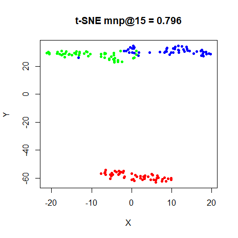

### s1k

| |
:-------|:-------------------:|
|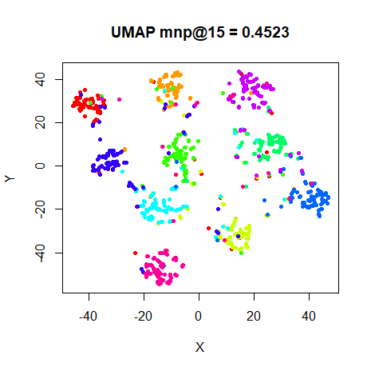|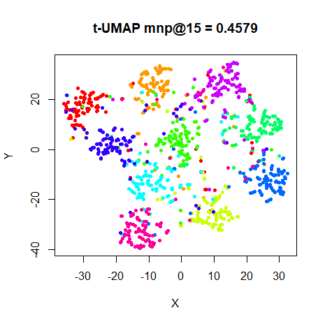
|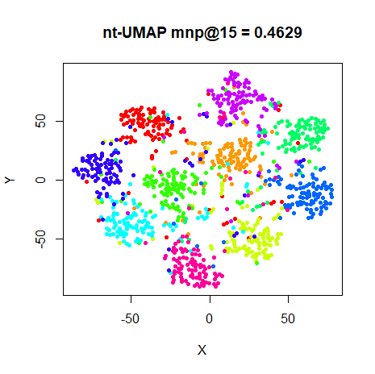|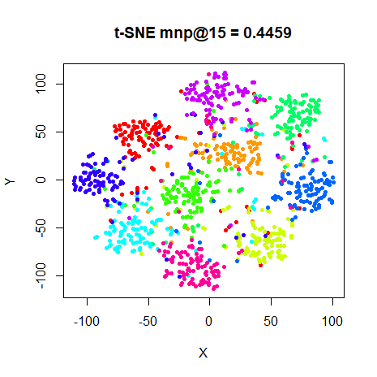


### oli

| |
:-------|:-------------------:|
|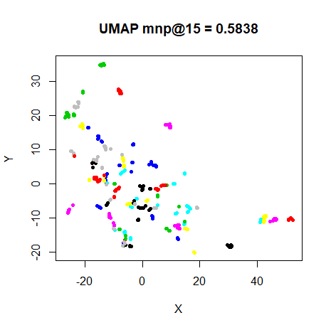|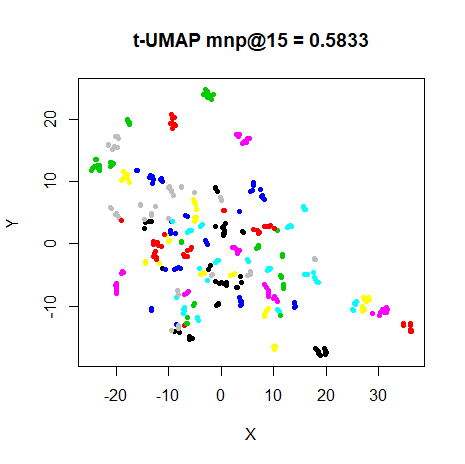
|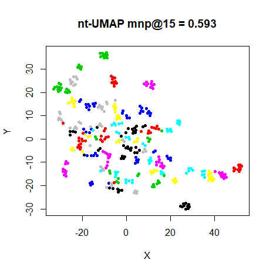|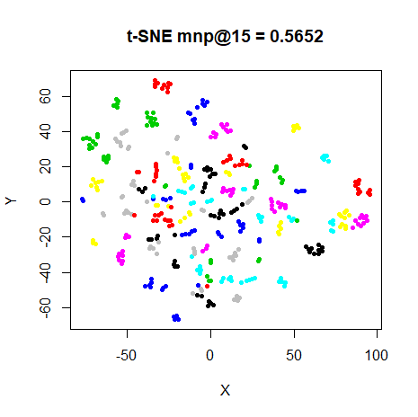


### frey

| |
:-------|:-------------------:|
|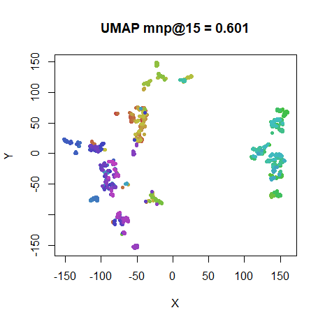|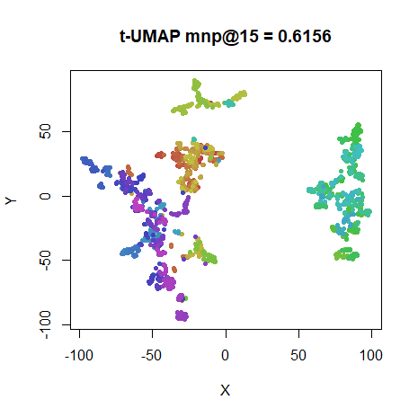
|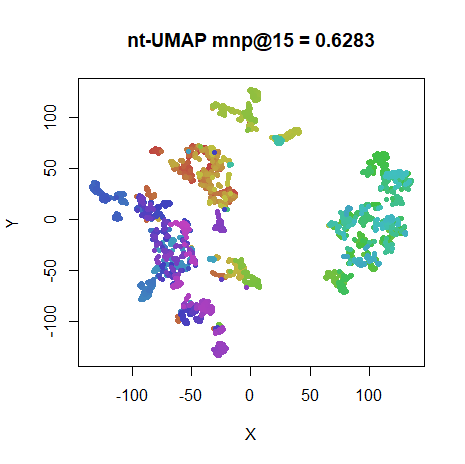|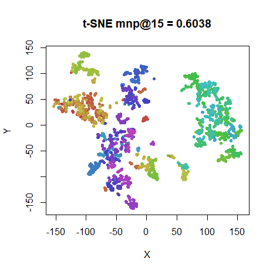

### coil20

| |
:-------|:-------------------:|
|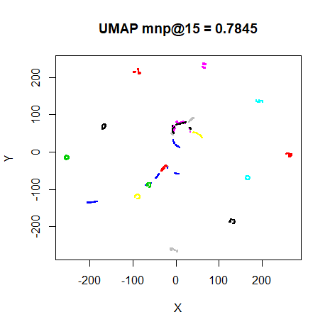|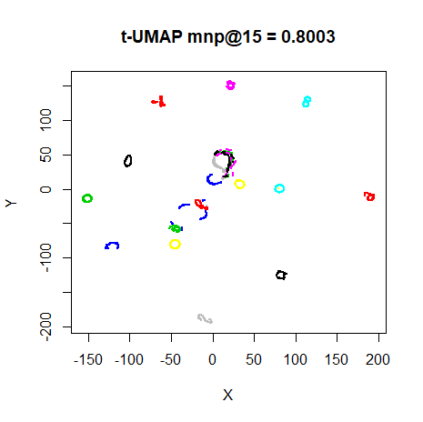
|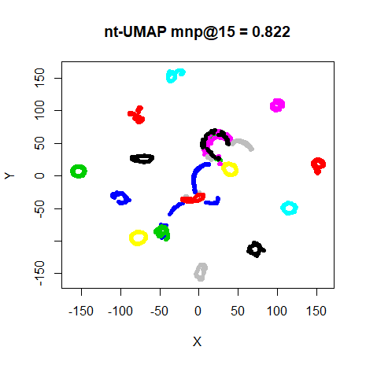|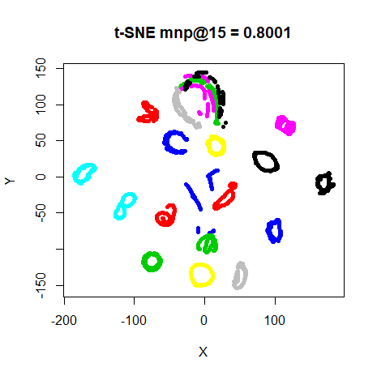

Note: for the UMAP and t-UMAP results, I reduced the point size so the structure
of the loops could be more easily seen.

### mnist

| |
:-------|:-------------------:|
|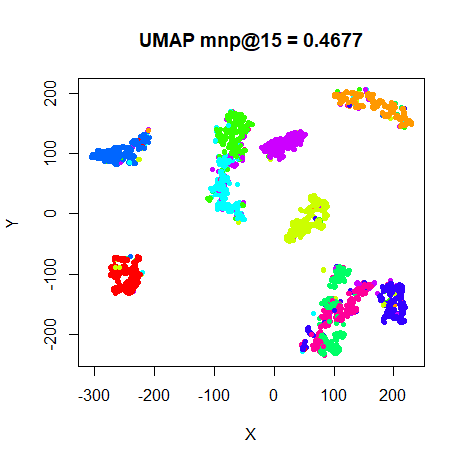|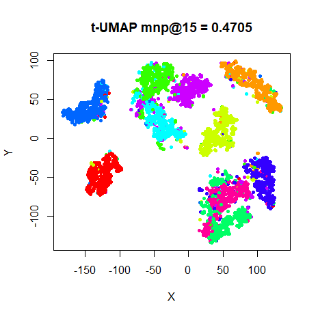
|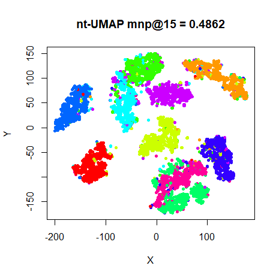|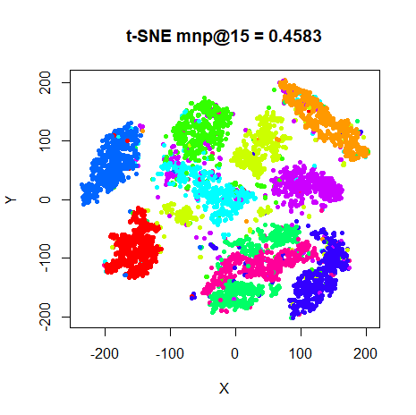

### fashion

| |
:-------|:-------------------:|
|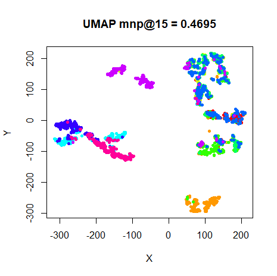|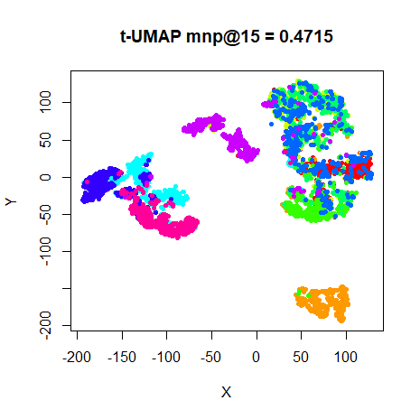
|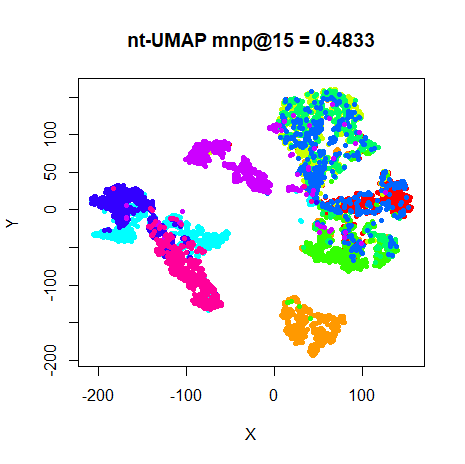|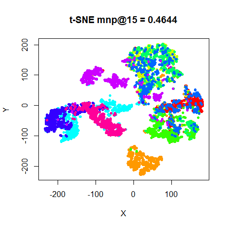


## Conclusions

The UMAP results are remarkable in that they thoroughly resemble the t-SNE
results in their broad shapes. This, despite the fact that no normalization of
the output similarities are carried out (which in turn makes it amenable to scaling
up to much larger dataset sizes via stochastic gradient descent). The default
output similarity kernel tends to produce smaller, more well separated clusters,
but the t-UMAP results are closer to the t-SNE results. It also has the advantage
(in the context of `smallvis`) of being faster to optimize because the gradient
is simpler. The UMAP and t-UMAP results for `mnist` and `fashion` might even be
said to be superior to that of t-SNE, although some of that effect is due to
the sparser nature of the input weights -- see the conclusions in the
[follow-up](https://jlmelville.github.io/smallvis/umaptsne.html) document.

For `coil20`, the UMAP curve settings might be said to produce *too* separated
clusters. However, the choice of `k = 15` seems like a better choice
for preserving the loop topology for that dataset (and confirmed with the
`perplexity = 15` results for t-SNE). The only UMAP embedding I don't like much 
is for `oli`, and that can be fixed by using a larger value of k (a t-SNE-like
`perplexity = 40`, for example):

||
|:-------|
|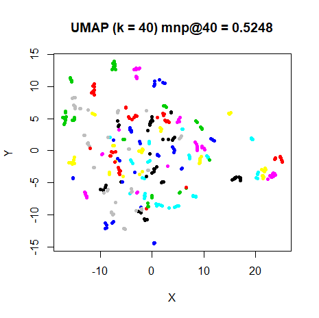|

The normalized version, nt-UMAP, is even closer to the t-SNE results and can be
optimized easily via the DBD method. DBD optimization of the UMAP and t-UMAP
cost functions were certainly a *lot* slower than the equivalent t-SNE result, but
this is an observation of limited practical significance. In real-world use of
UMAP (i.e. using the real Python UMAP, not its implementation in `smallvis`),
stochastic gradient descent is used, seems very fast and scales much better than
t-SNE.

However, in a more general sense, it may be that there is something about the
normalization that causes DBD to start working well. Or there may be a scheme to
balance the positive and negative parts of the gradient that makes DBD start
working with un-normalized (and hence separable) cost functions. This might be
worth looking into.

*February 17, 2018*: some more UMAP-related work, looking at 
[importing some of UMAP's ideas into t-SNE](https://jlmelville.github.io/smallvis/umaptsne.html).

Up: [Documentation Home](https://jlmelville.github.io/smallvis/).
